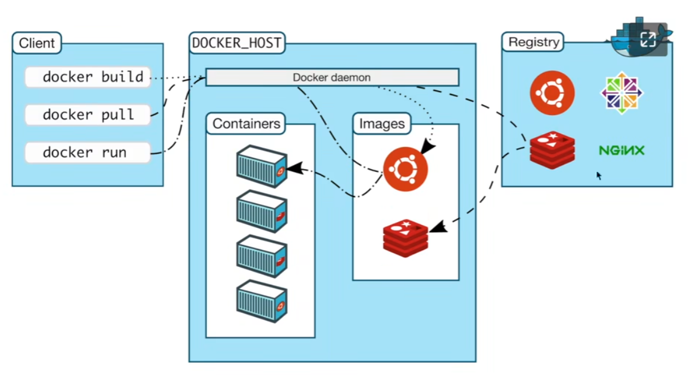
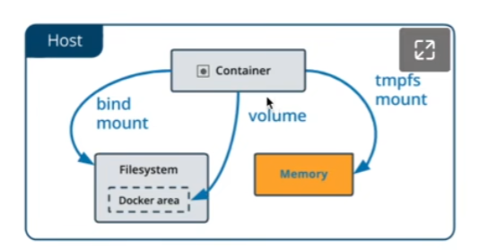
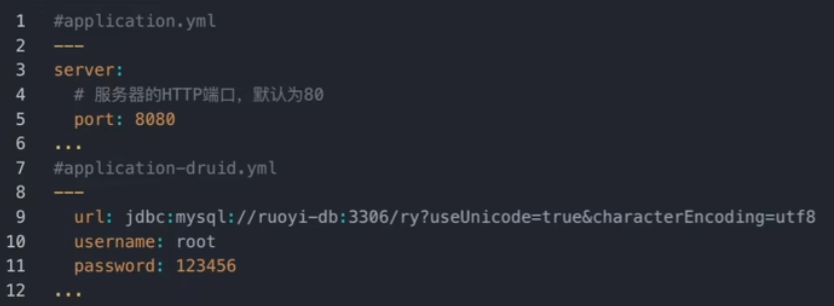
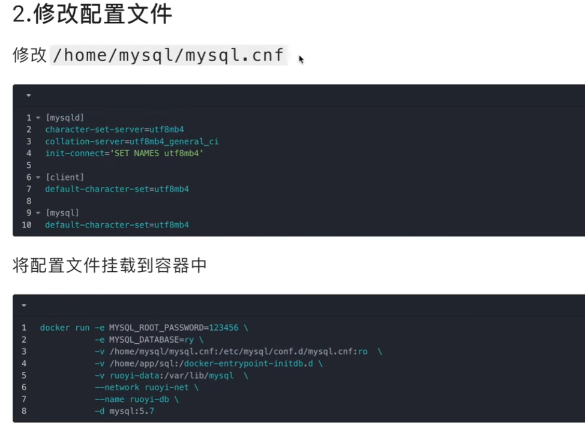
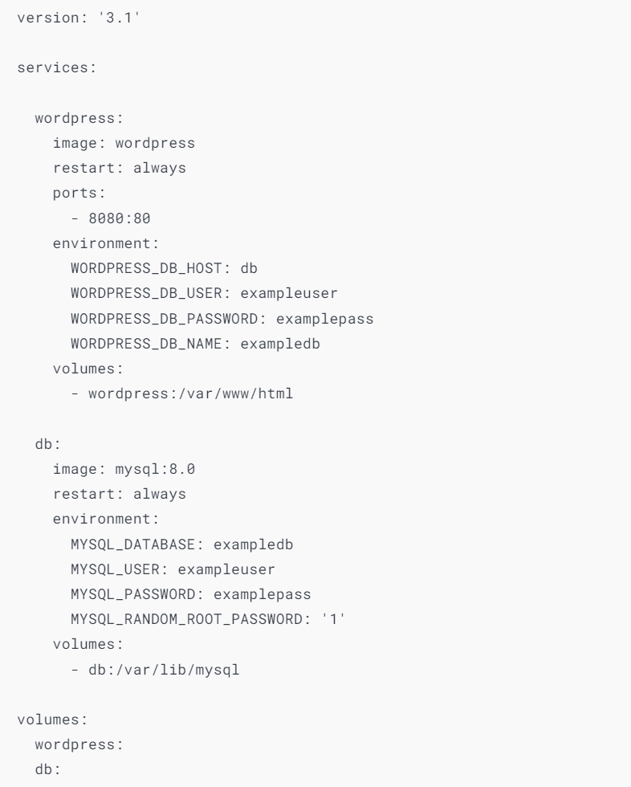

- https://www.yuque.com/wukong-zorrm/xwas40
## Docker和虚拟机的不同
#### 1、启动速度不同
- docker：启动 Docker 相当于启动宿主操作系统上的一个进程，启动速度属于秒级别。
- 虚拟机：启动虚拟机需要先启动虚拟机的操作系统，再启动应用，这个过程非常慢，通常需要几分钟。

#### 2、占用资源不同
- docker：Docker 只是一个进程，只需要将应用以及相关的组件打包，在运行时占用很少的资源，一台机器可以开启成千上万个 Docker。容器运行时，与宿主机共享操作系统内核，容器在inux内核层面 (使用 Cgroups 和 namespaces) 来实现进程间的隔离。
- 虚拟机：虚拟机是一个完整的操作系统，需要占用大量的磁盘、内存和 CPU 资源，一台机器只能开启几十个的虚拟机。

#### 3、隔离性不同
- docker：docker隔离性更弱，docker属于进程之间的隔离。
- 虚拟机：虚拟机隔离性更强，可实现系统级别隔离。

#### 4、安全性不同
- docker：docker的安全性更弱。Docker的租户root和宿主机root等同，一旦容器内的用户从普通用户权限提升为root权限，它就直接具备了宿主机的root权限，进而可进行无限制的操作，容器至今还没有任何形式的硬件隔离，这使得容器容易受到攻击。
- 虚拟机：虚拟机租户root权限和宿主机的root虚拟机权限是分离的，并且虚拟机利用如Intel的VT-d和VT-x的ring-1硬件隔离技术，这种隔离技术可以防止虚拟机突破和彼此交互。

#### 5、可管理性不同
- docker：docker的集中化管理⼯具还不算成熟。
- 虚拟机：各种虚拟化技术都有成熟的管理工具，例如VMware vCenter提供完备的虚拟机管理能⼒。

#### 6、高可用和可恢复性
- docker：docker对业务的高可用支持是通过快速重新部署实现的。
- 虚拟机：虚拟化具备负载均衡，高可用，容错，迁移和数据保护等经过⽣产实践检验的成熟保障机制，VMware可承诺虚拟机99.999%高可用，保证业务连续性。

#### 7、创建、删除速度不同
- docker：Docker容器创建是秒级别的，Docker的快速迭代性，决定了⽆论是开发、测试、部署都可以节约⼤量时间。
- 虚拟机：虚拟化创建是分钟级别的。

#### 8、交付部署不同
- docker：Docker在Dockerfile中记录了容器构建过程，可在集群中实现快速分发和快速部署。
- 虚拟机：虚拟机可以通过镜像实现环境交付的⼀致性，但镜像分发⽆法体系化。

## Docker
##### Docker是一个开源的应用容器引擎，由于docker影响巨大，今天也用“Docker”指代容器化技术。

### Docker优势

#### 一键部署，开箱即用
- 容器使用基于image镜像的部署模式，image中包含了运行应用程序所需的一切: 代码运行时、系统工具、系统库和配置文件。无论是单个程序还是多个程序组成的复杂服务，或者分布式系统，都可以使用 ```docker run``` 或 ```docker compose up``` 命令一键部署，省去了大量搭建、配置环境、调试和排查错误的时间。
#### 一次打包，到处运行
- Docker 为容器创建了行业标准，使容器成为了软件交付过程中的一种标准化格式，将软打包成容器镜(image)，能够使软件在不同环境下运行一致，应用程序可以快速可靠地从一个环境移植到另外一个环境，并确保在所有的部署目标 (例如开发、测试、生产环境)上都按预期运行，从而避免了“在我电脑上是好的，怎么到你那却不能用了?”的问题。

### Docker安装
#### 安装环境: CentOS7.3+
- 如果之前安装了旧版docker，请先删除
```sudo yum remove docker ocker-client docker-client-latest docker-common docker-latest docker-latest-logrotate docker-logrotate docker-engine```

#### 安装仓库
- ```sudo yum install -y yum-utils```
- 添加源 ```sudo yum-config-manager --add-repo https://download.docker.com/linux/centos/docker-ce.repo```

#### 安装Docker
- ```sudo yum install docker-ce docker-ce-cli containerd.io docker-compose-plugin```

#### 启动docker
- ```sudo systemctl start  docker```
- ```sudo docker run hello-word```


#### 配置国内镜像
- 配置文件在```/etc/docker```，新建daemon.json
- ```{```
```"registry-mirrors":[```
```"https://registry.docker-cn.com",```
```"http://hub-mirror.c.163.com",```
```"https://fsp2sfpr.mirror.aliyuncs.com/"]```
```}```
#### 然后重启，配置开机启动
- ```sudo system&tl restart docker```
- ```sudo systemctl enable docker``` //docker开机启动
- ```sudo systemctl enable containerd```//containerd开机启动

### docker pull 命令

- 运行镜像可以产生容器
- 如:```docker pull nginx:1.22``` //默认为最新版本
- 查看本地镜像，```docker images``` 
- 查看运行中的镜像命令，```docker ps``` 
- 查看启动日志命令，```docker logs 容器名称或者id``` 

#### 公开端口(-p)
```docker run --name some-nginx -d -p 8080:80 nginx:1.22```
- some-nginx为容器的名称，-d表示容器在后台运行。-p表示将容器的端口80绑定到宿主机的端口8080。
- 默认情况下，容器无法通过外部网络访问。需要使用-p参数将容器的端口映射到宿主机端口，才可以通过宿主机IP进行访问。浏览器打开 http://192.168.56.106:8080
- ```docker stop some-nginx```  //停止容器
- ```docker ps -a``` //查看所有的容器
- ```docker rm 容器id或者名称``` //删除容器
- ```-p 8080-8090:8080-8090``` //公开端口范围，前后必须对应
- ```-p 192.168.56.106:8080:80``` //如果宿主机有多个ip，可以指定绑定到哪个ip

#### docker run开箱即用
- ```docker inspect some-mysql（容器名称）``` //查看容器的信息


#### 前台交互运行
- 创建一个新的容器，使用mysql客户端```docker run -it --rm mysql:5.7 mysgl -h172.17.0.2 -uroot -p``` 
- ```-it```使用交互模式，可以在控制台里输入、输出 
- ```--rm```在容器退出时自动删除容器。一般在使用客户端程序时使用此参数如果每次使用客户端都创建一个新的容器，这样将占用大量的系统空间```mysql -h172.17.0.2 -uroot -p``` 表示启动容器时执行的命令。
- 例如: docker run -it --rm mysql:5.7 mysql -h172.17.0.2 -uroot -p 
- ```docker exec```
- 在运行的容器中执行命令，一般配合```-it``` 参数使用交互模式
- ```docker exec -it db-mysql /bin/bash```

### docker 网络（三种+一种自定义）
#### bridge桥接网络
- 如果不指定，新创建的容器默认将连接到bridge网络。默认情况下，使用bridge网络，宿主机可以ping通容器ip，容器中也能ping通宿主机。容器之间只能通过P 地址相互访问，由于容器的ip会随着启动顺序发生变化，因此不推荐使用ip访问。
#### host
慎用，可能会有安全问题
- 容器与宿主机共享网络，不需要映射端口即可通过宿主机IP访问。 (-p选项会被忽略)主机模式网络可用于优化性能，在容器需要处理大量端口的情况下，它不需要网络地址转换 (NAT)，并且不会为每个端口创建“用户空间代理”。
#### none
- 禁用容器中所用网络，在启动容器时使用。
- ```docker ps``` 查看运行的容器
- ```docker inspect --formate='{{range .NetworksSettings.Networks}}{{.IPAddress}{{end}}' 容器名称``` //显示容器ip
- ```curl 172.17.0.3:80``` //在宿主机直接访问80端口
- ```docker exec -it some-nginx /bin/bash``` //进入其中一个容器，进行容器间的ping通信
- docker hub 搜索busybox
- ```docker run -it --rm busybox``` //启动busybox工具
- ```ping 172.17.0.2``` //可以ping
- 以上说明在bridge模式下，容器之间是可以通信的，也可以ping通宿主机。

#### 用户自定义网络
- 创建用户自定义网络
- ```docker network create my-net```
- 将已有容器连接到此网络
- ```dogker network connect my-net some-mysql```
- ```dogker network disconnect my-net some-mysql``` //断开
- 创建容器时指定网络
- ```docker run -it --rm --network my-net mysql:5.7 mysql -hsome-mysql -uroot -p```
- 在用户自定义网络上，容器之间可以通过容器名进行访问，不需要桥接下的ip访问。
- 用户自定义网络使用 Docker 的嵌入式DNS服务器将容器名解析成IP。

### docker 存储
- 将数据存储在容器中，一旦容器被删除，数据也会被删除。同时也会使容器变得越来越大，不方便恢复和迁移。
- 将数据存储到容器之外，这样删除容器也不会丢失数据。一旦容器故障，我们可以重新创建一个容器，将数据挂载到容易里，就可以快速的恢复。
#### 存储方式
- docker提供了以下存储选项

##### volumn卷
- **卷**存储在主机文件系统分配一块专有存储区域，由 Docker (在 Linux 上)管理，并且与主机的核心功能隔离。非 Docker 进程不能修改文件系统的这一部分。卷是在 Docker 中持久保存数据的最佳方式
##### bind mount绑定挂载
- **绑定挂载**可以将主机文件系统上目录或文件装载到容器中，但是主机上的非 Docker 进程可以修改它们，同时在容器中也可以更改主机文件系统，包括创建、修改或删除文件或目录，使用不当，可能会带来安全隐患。
##### tmpfs 临时挂载
- **tmpfs挂载**仅存储在主机系统的内存中，从不写入主机系统的文件系统。当容器停止时数据将被删除。

##### 绑定挂载(bind mount)
- 绑定挂载适用以下场景:
- 将配置文件从主机共享到容器
- 在Docker主机上的开发环境和容器之间共享源代码或编译目录
- 例如，可以将 Maven 的 **target/**目录挂载到容器中，每次在主机上用 Maven打包项目时，容器内- 都可以使用新编译的程序包。
###### -v参数
- 绑定挂载将主机上的目录或者文件装载到容器中。绑定挂载会覆盖容器中的目录或文件。如果宿主机目录不存在，docker会自动创建这个目录。但是docker只自动创建文件夹，不会创建文件。
- 例如，容器内mysql的配置文件和数据存储目录使用主机的目录。可以将配置文件设置为只读(read-only)防止容器更改主机中的文件。(在容器内不能编辑，在宿主机上可以修改)
- ```docker run -e MYSQL_ROOT_PASSWORD=123456 \```
- ```-v /home/mysql/mysql.cnf:/etc/mysql/conf.d/mysql.cnf:ro \``` //:前面是宿主机目录，:后面是容器目录
- ```-v /home/mysql/data:/var/lib/mysql \```
- ```-d mysql:5.7 ```
- 在宿主机上home目录下创建mysql文件夹
- 在其创建mysql配置文件mysql.cnf

##### volume 卷
- 卷是docker 容器存储数据的首选方式，卷有以下优势:
- 卷可以在多个正在运行的容器之间共享数据。仅当显式删除卷时，才会删除卷
- 当你想要将容器数据存储在外部网络存储上或云提供商上，而不是本地时。
- 当您需要备份、还原数据或将数据从一个 Docker 主机迁移到另卷更容易备份或迁移，一个 Docker 主机时，卷是更好的选择。
- ```docker create volume vol-my-data```
- ```docker run --name some-mysql-vol -e MYSQL_ROOT_PASSWORD=123456 \```
- ```-v /home/mysql/vol-my-data :/etc/mysql/conf.d/mysql.cnf:ro \``` 
- ```-v /home/mysql/vol-my-data:/var/lib/mysql \```
- ```-d mysql:5.7 ```
- ```docker inspect vol-my-data``` //查看卷


##### --tmpfs 临时挂载
- 临时挂载将数据保留在主机内存中，当容器停止时，文件将被删除
- ```docker run -d -it --tmpfs /tmp nginx:1.22-alpine```

### 部署应用
- 本例子我们使用docker来部署一个应用系统，RuoYi是一款用iava编写的，基于SpringBoot+Bootstrap的后台管理系统。
- ruoyi官方文档: http://doc.ruoyi.vip/ruoyi/
- 源码下载: https://gitee.com/y_project/RuoYi/tree/v4.7.4/将源码编译打包成ruoyi-admin.jar文件，放到宿主机/home/app目录下，/home/app/sql目录下是数据库初始化脚本。
- 配置文件中修改了端口、数据库连接信息。

- 创建自定义网络 docker network create ruoyi-net
- 创建卷来存储数据 docker volume create  ruoyi-data

##### 我们在创建数据库容器的时候，需要做三件事:
- 创建数据库ry
- 设置字符集为utf-8
- 执行数据库初始化脚本
- 使用MYSQLDATABASE环境变量创建数据库设置字符集```--character-set-server=utf8mb4 --collation-server=utf8mb4_unicode_ci```
- 容器使用/docker-entrypoint-initdb.d目录下的脚本初始化数据库，脚本可以是.sh .sql和.sql.gz 这三种格式。
- ```docker run --name ruoyi-db \```
- ```-v ruoyi-data:/var/lib/mysql \```
- ```-v /home/app/sql:/docker-entrypoint-initdb.d \```
- ```-e MYSQL DATABASE=ry \ ```
- ```-e MYSQL ROOT_PASSWORD=123456 -d mysql:5.7 \```
- ```--character-set-server=utf8mb4 --collation-server=utf8mb4_unicode_ci```
- 连接自定义网络 ```docker network connect ruoyi-net ruoyi-db```
- 部署jar包，通过绑定挂载的方式加载到应用中
- 拉取镜像docker pull openjdk:8u342-jre

- ```docker run --name ruoyi-app \```
- ```-p 8080:8080 \```
- ```--network ruoyi-net \```
- ```-v /home/app/ruoyi-admin.jar:/usr/local/src/ruoyi-admin.jar \```
- ```-d openjdk:8u342-jre \```
- ```java -jar /usr/local/src/ruoyi-admin.jar ```

##### 运行之后，出现客户端访问乱码
- 1.修改运行参数
- 使用环境变量 LANG=C.UTF-8 设置客户端字符集

- 2.修改配置文件
- 修改/home/mysql/mysql.cnf


### docker compose 容器编排
- 在实际工作中，部署一个应用可能需要部署多个容器，一个一个部署非常不方便。docker compose可以一键部署和启动多个容器，它使用yaml文件来编排服务。github和docker hub很多项目都提供了docker-compose.yaml文件，我们可以一键部署项目，非常方便。

#### 一键部署wordpress
- wordpress是一个著名的开源博客系统
- 将以下内容保存到本地的```docker-compose.yml```文件中。
- ```docker compose``` 命令启动时，默认在当前目录下寻找 ```compose.yaml```或 ```compose.yml```，为了兼容之前的版本，也会查找 ```docker-compose.yaml```或 ```docker-compose.yml```。
- 也可以使用```-f```参数手动指定文件 ```docker compose -f docker-compose-dev.yml up -d```

- 在home目录下，创建wordpress
- 创建```docker-compose.yaml```文件 

- ```docker compose up -d``` //一键部署
- ```docker compose stop``` 
- ``` docker logs -f``` 
- ``` docker compose start```
- ``` docker compose down``` //删除容器，和网络，不会删除卷
- ``` docker volume ls``` 
- ```docker compose up -d``` //在此启动，数据依然存在
- ```docker exec -it wordpress-wordpress-1 /bin/bash``` //方式1: 进入容器中执行命令
- ```docker compose exec -it wordpress /bin/bash``` //方式2: 进入容器中执行命令
- ```docker compose -p my up -d``` //改变前缀为my
