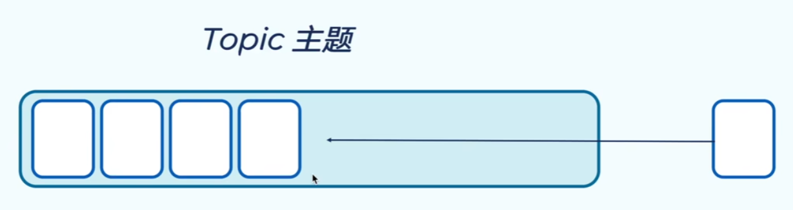
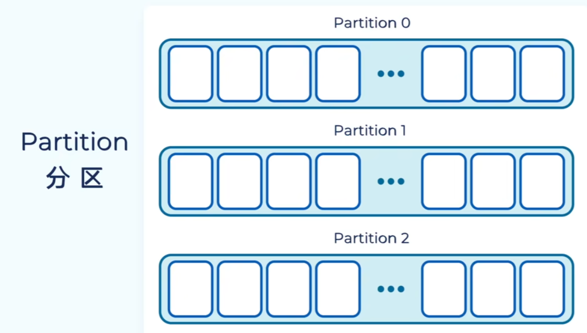
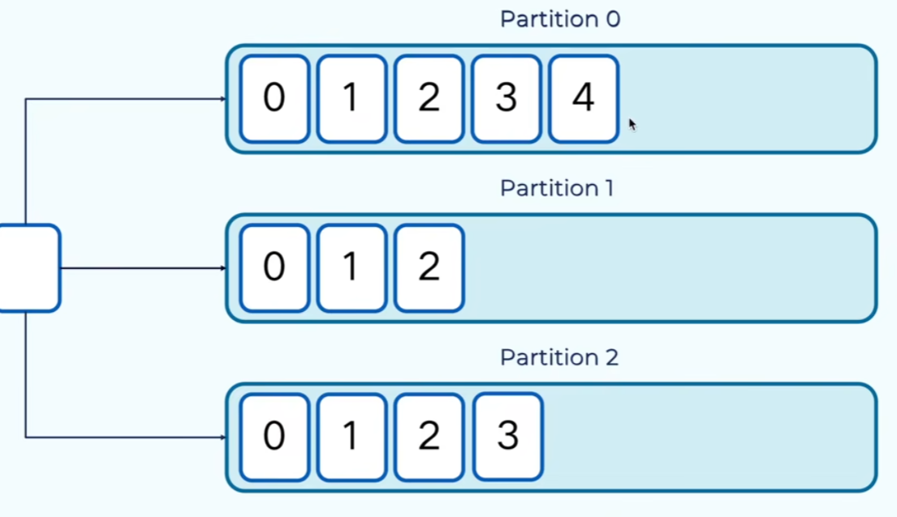
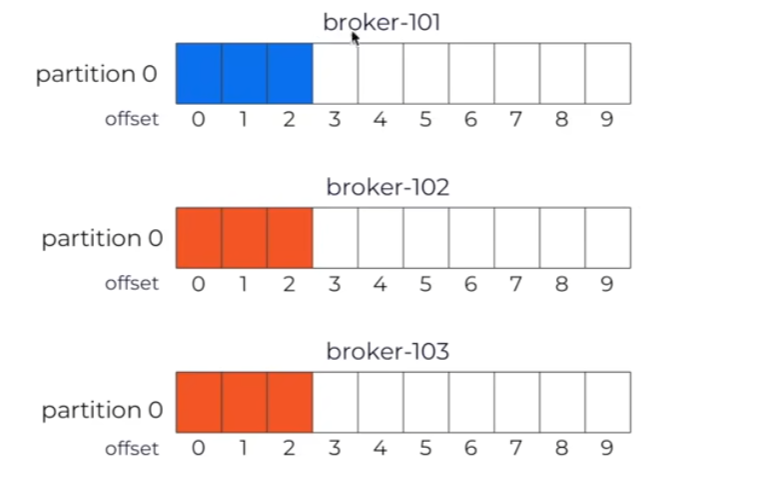
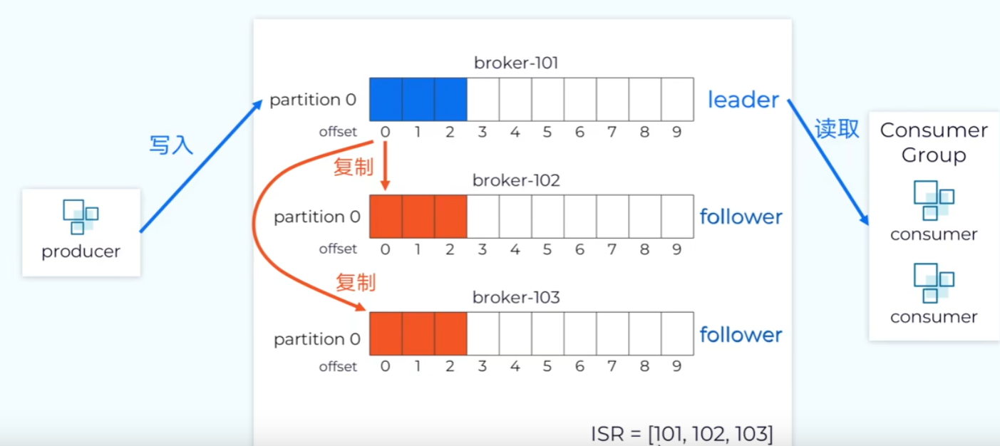
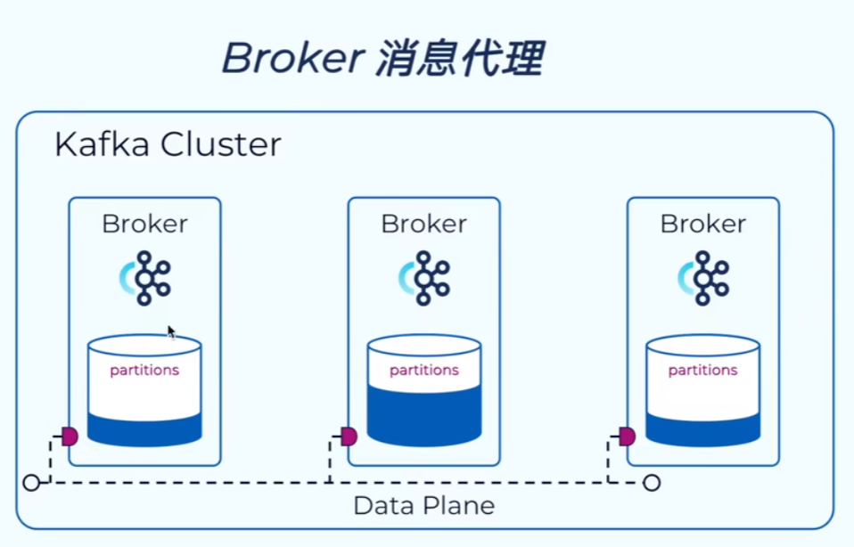

## kafka优点
- 吞吐量高，性能好
- 伸缩性好，支持在线水平扩展
- 容错性和可靠性
- 与大数据生态紧密结合，可无缝对接hadoop、strom、spark等
## 常见的消息队列
### AMQP 模型
- 三大实体：队列 (queues)、信箱 (exchanges)、绑定(bindings)
- 特点:支持事务，数据一致性高，多用于银行、金融行业
- Pivotal RabbitMQ
- Spring AMQP与Spring JMS

## 主题、分区、副本、消息代理
### 消息存在于主题中（类似于数据库中的表）

### 主题可以包含多个分区，具有拓展性，不同的分区存在不同的服务器

### 分区是线性增长的，不可变的提交日志，当我们的消息存储到分区之后，消息不可变更，kafka会给每条消息一个偏移量（offset），kafka通过偏移量对消息进行提取，不能对消息的内容进行检索和查询。偏移量是递增的，不可重复的，不同分区的偏移量时可以重复。

### kafka中的消息是以键值对的形式存储，key可以为空，kafka会将消息以轮询的方式写入分区中。如果指定key，相同key的消息会被写入同一个分区中。
### 分区保证了kafka的集群可以扩展。kafka通过副本机制保证数据的可靠性，可以通过设置replication-factors=3来设置kafka副本的数量

### kafka会选择一个副本作为主分区leader，所有数据写入到leader，读取也是从leader中读取。其他副本为follwer，只是负责从leader中复制数据，保证一致性。kafka会兼顾副本之间数据同步的状态，在原数据中会维护一个ISR的集合，ISR就是正在同步的副本集，如果某个副本不能正常的同步数据或者落后比较多，kafka会将这个节点从ISR中剔除。

### kafka集群由多个broker（消息代理）组成。broker负责消息的读写请求，并将数据写入到磁盘中，通常一台服务器上就会启动一个broker的实例，一台服务器就是一个broker

### kafka集群由8哥broker组成，集群中的主题有8个分区组成（p0-p7），副本因子为3（replication-factors=3），每个数据存在3份（1个leader，2个follwer）。
