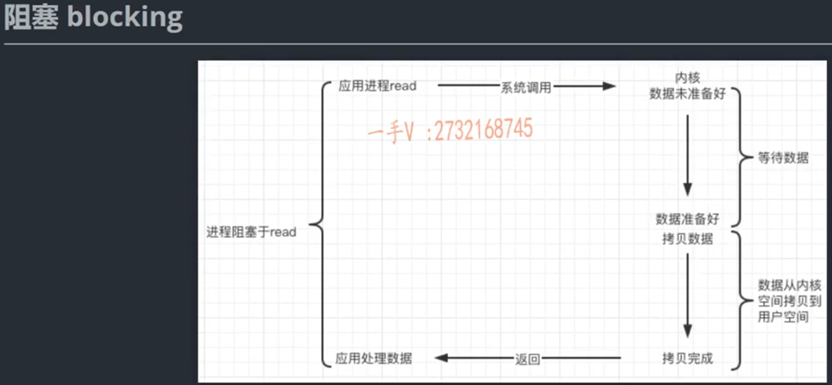
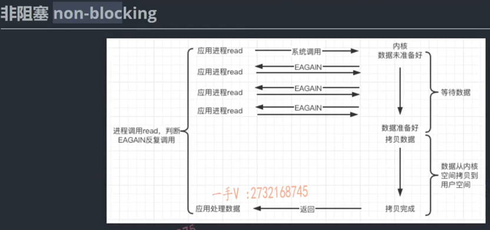
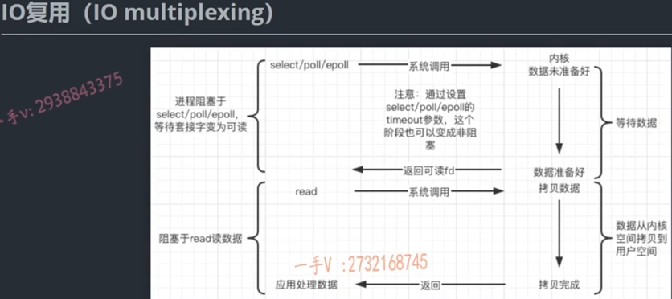
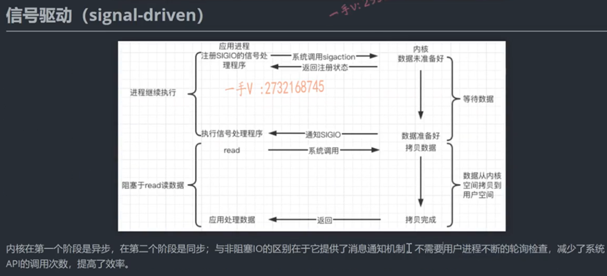
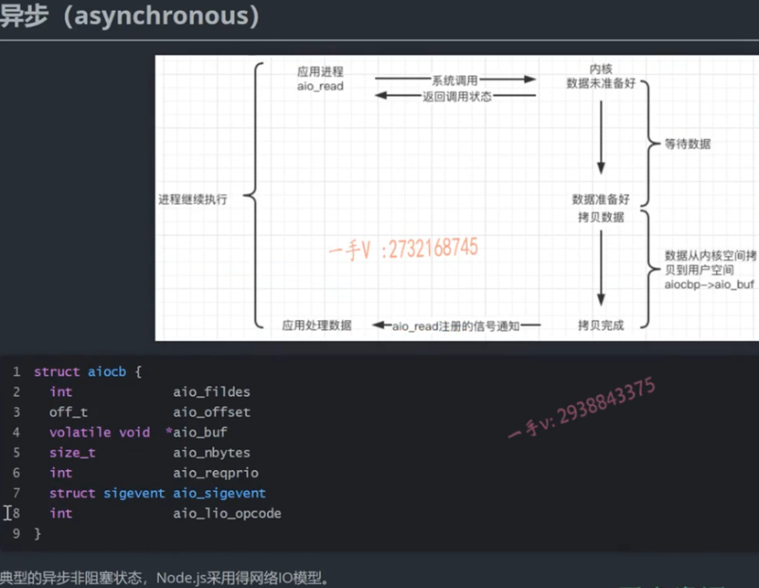

## 1、Linux的五种I/O模型

**阻塞、非阻塞、IO多路复用(poll,select,epoll)、信号驱动(sigaction)、异步五种I/O模型。**

### 1.1 阻塞


- 在此模式中，当应用程序执行I/O操作时，如果数据还没有准备好，应用程序就会被阻塞（挂起），直到数据准备好为止。这期间，应用程序不能做其他事情。

 
### 1.2 非阻塞

- 在此模式中，如果I/O操作的数据还没有准备好，操作会立即返回一个错误，而不是阻塞应用程序。应用程序可以继续执行其他操作，也可以反复尝试该I/O操作。这种模型需要线程轮询来检查I/O操作的就绪状态，以及可能的数据可用性。
- 一组非阻塞的系统调用，例如read()、write()、open()，比如调用read之前，将setsockopt(sockfd)设置为non-blocking，与上面相比，数据未就绪，可以通过轮询，不断返回(一个错误码(例如EAGAIN或EWOULDBLOCK))，通过返回值的判断。数据准备好以后，数据从内核TCP缓冲去拷贝到应用程序的buffer缓冲区，还是要花费应用程序的事件，这是一个**同步**的操作。


### 1.3 IO多路复用(事件驱动I/O)


- 在此模式中，应用程序可以同时监控多个I/O描述符(比如,socket), 当任何一个I/O描述符准备好数据时, 应用程序就可以对其进行处理。这可以在一个单独的进程或线程中同时处理多个I/O操作, 并且不需要阻塞或轮询。select、poll、epoll都是这种模型的实现。

### 1.4 信号驱动

- 在此模型中, 应用程序可以向操作系统注册一个信号处理函数sigaction, 当数据准备好时(当文件描述符主备好),操作系统会发送一个信号, 应用程序可以在接收到信号时读取数据。这种模式避免了阻塞和轮询,但是编程复杂性较高。**文件描述符就是该文件对应的打开文件表中表项的索引值。**

### 1.5 异步I/O

- 在此模型中，应用程序发起I/O操作后，可以立即开始做其他事情，当数据准备好时，操作系统会将数据复制到应用程序的缓冲区，并通知应用程序。这种模型的优点是应用程序不需要等待I/O操作的完成，缺点是编程复杂性较高。


## 2、IO多路复用中的poll、select、epoll区别
#### 2.1 select模型
##### 监视多个文件描述符（在网络编程中，文件描述符通常代表一个socket连接），直到其中一个文件描述符准备好进行某种IO操作（如读或写）为止。使用select模型的优点是跨平台性好，基本上所有的操作系统都支持。但是它有一些明显的缺点，如单个进程能够监视的文件描述符数量有限（通常是1024），处理效率较低（每次调用select都需要遍历所有的文件描述符），以及它不能随着连接数的增加而线性扩展。
#### 2.2 poll模型
##### poll模型和select模型非常相似，但它没有最大文件描述符数量的限制。和select一样，poll每次调用时也需要遍历所有的文件描述符，同样不能随着连接数的增加而线性扩展。
#### 2.3 epoll模型
##### 在Linux 2.6及以后版本中引入的新型IO多路复用模型。与select和poll相比，epoll在处理大量并发连接时更高效。它默认使用了一个事件驱动的方式（水平触发LT），以**红黑树**作为底层的数据结构，只有当某个文件描述符准备好进行IO操作时，它才会将这个文件描述符添加到就绪列表中，这避免了遍历所有文件描述符的开销。另外，epoll没有最大文件描述符数量的限制，因此它可以处理更多的并发连接。

**下面是详解**
## 3、select、poll、epoll优势和缺陷总结
#### IO多路复用指的是用一个用户线程就可以查询所有套接字（文件描述符）数据是否准备就绪。分两步走: 
- (1)、先查询哪些文件描述符对应的IO事件准备就绪，这里的查询可以通过select、poll、epoll 等系统调用。
- (2)、最后将准备就绪的套接字，通过read或者write等系统调用进行实际的读写操作。

#### select实现多路复用的方式是，将已连接的socket都放到一个文件描述符集合，然后调用select函数**将文件描述符集合拷贝到内核态**里，让内核来检查是否有网络事件产生，检查的方式很粗暴，就是通过遍历文件描述符集合的方式，当检查到有事件产生后，将此socket**标记**为可读或可写，接着**再把整个文件描述符集合拷贝回用户态**里，然后用户态还需要再通过**遍历**的方法找到可读或可写的socket，然后再对其处理。
#### 所以，对于select这种方式，需要进行2次[遍历]文件描述符集合，一次是在内核态里，一个次是在用户态里，而且还会发生2次[拷贝]文件描述符集合，先从用户空间传入内核空间，由内核修改后，再传出到用户空间中。
#### select使用固定长度的BitsMap（位图），表示文件描述符集合，而且所支持的文件描述符的个数是有限制的，在Linux系统中，由内核中的FD_SETSIZE限制，默认最大值为1024，只能监听0~1023的文件描述符。
#### poll不再用BitsMap（位图）来存储所关注的文件描述符，取而代之用**动态数组**，以**链表形式**来组织，突破了select的文件描述符个数限制，当然还会受到系统文件描述符限制。
#### 但是poll和select并没有太大的本质区别，都是使用「线性结构」存储进程关注的Socket集合，因此都需要遍历文件描述符集合来找到可读或可写的 Socket，时间复杂度为**O(n)**，而且也需要在用户态与内核态之间拷贝文件描述符集合，这种方式随着并发数上来，性能的损耗会呈指数级增长。

### epoll采用红黑树组织管理sockfd，以支持快速的增删改查。
#### epoll 通过两个方面，很好解决了 select/poll 的问题。
#### epoll在内核里使用**红黑树**来跟踪进程所有待检测的文件描述字，把需要监控的socket通过epoll_ctl()函数加入内核中的红黑树里，红黑树是个高效的数据结构，增删改一般时间复杂度是**O(logn)**。而select/poll内核里没有类似epoll红黑树这种保存所有待检测的socket的数据结构，所以select/poll每次操作时都传入整个socket集合给内核，而epoll因为在内核维护了红黑树，可以保存所有待检测的socket，所以只需要传入一个待检测的socket，减少了内核和用户空间大量的数据拷贝和内存分配。
#### epoll使用事件驱动的机制，内核里维护了一个链表来记录就绪事件，当某个socket有事件发生时，通过回调函数内核会将其加入到这个就绪事件列表中，当用户调用epoll_wait()函数时，只会返回有事件发生的文件描述符的个数，不需要像select/poll那样轮询扫描整个socket集合，大大提高检测的效率。
#### 由于epoll的实现机制与select/poll机制完全不同，上面所说的select的缺点在epoll上不复存在。

## 4、epoll有两种触发模式：水平触发（LT）和边缘触发（ET）。

- **水平触发（LT）**：默认工作模式。在这种模式下，只要被监控的文件描述符还有数据可以读取或者还能写入数据，就会**一直通知**该事件。也就是说，如果你没有处理完所有的数据，那么每次调用epoll的时候，它都会响应这个事件。只有你读或写到了EAGAIN，也就是没有更多的数据可以处理了，那么它在下一次epoll调用的时候才不会响应。
- **边缘触发（ET）**：在这种模式下，当被监控的文件描述符状态发生变化时，epoll只会通知一次该事件，直到该文件描述符的状态再次发生变化为止。也就是说，如果你没有处理完所有的数据或没有处理该事件，那么在下一次epoll调用的时候，它不会再响应这个事件。
- ET模式比LT模式效率更高，因为它避免了多次响应同一个事件，但使用ET模式需要更小心，因为如果你没有处理完所有的数据或没有处理该事件，那么**可能会丢失数据**。**在使用ET模式时，我们通常会使用非阻塞IO，这样我们可以尽可能的读取或写入所有的数据，直到收到EAGAIN错误为止。**

## 5、socket服务端示例：
### 一般来讲，我们要实现socket的时候，有五个关键的的步骤：

- 创建socket：使用socket()系统调用创建一个新的socket文件描述符。
- 绑定socket：使用bind()系统调用将新创建的socket绑定到一个地址和端口上。对于服务器程序来说，这个地址通常是服务器的IP地址，端口是你希望服务器监听的端口。
- 监听连接：使用listen()系统调用使得socket进入监听模式，等待客户端的连接请求。
- 接受连接：当一个客户端连接请求到来时，可以使用accept()系统调用接受这个连接，并获取一个新的socket文件描述符，这个描述符代表了服务器与客户端之间的连接。
- 读写数据：通过read()和write()或者send()、recv()系统调用在连接上读取或写入数据。
以上就是一个最基本的Socket服务器的工作流程。当然，在实际的应用开发中，根据应用的需要，可能还会使用更多的系统调用和库函数，例如使用select(), poll() 或 epoll() 处理多个并发连接，使用线程或进程来并行处理多个连接等。

#### 示例如下：
```
#include <iostream>
#include <string.h> 
#include <sys/socket.h>
#include <netinet/in.h> 

#define MAX_BUFFER_SIZE 4096 
#define PORT 8080

int main() {
    int server_fd, new_socket;
    struct sockaddr_in address;
    int opt = 1;
    int addrlen = sizeof(address);
    char buffer[MAX_BUFFER_SIZE] = {0};
    
    // 创建 socket 文件描述符
    if ((server_fd = socket(AF_INET, SOCK_STREAM, 0)) == 0) {
        std::cerr << "socket failed" << std::endl;
        exit(EXIT_FAILURE);
    }
    
    // 绑定 socket 到 localhost 的 8080 端口
    address.sin_family = AF_INET;
    address.sin_addr.s_addr = INADDR_ANY;
    address.sin_port = htons(PORT);

    if (bind(server_fd, (struct sockaddr *)&address, sizeof(address)) < 0) {
        std::cerr << "bind failed" << std::endl;
        exit(EXIT_FAILURE);
    }
    
    // 使服务器开始监听，这里我们设定最大待处理连接数为 3
    if (listen(server_fd, 3) < 0) {
        std::cerr << "listen failed" << std::endl;
        exit(EXIT_FAILURE);
    }
    
    while(1) {
        std::cout << "\nWaiting for a connection..." << std::endl;

        // 接受客户端连接
        if ((new_socket = accept(server_fd, (struct sockaddr *)&address, (socklen_t*)&addrlen))<0) {
            std::cerr << "accept failed" << std::endl;
            exit(EXIT_FAILURE);
        }

        // 清空 buffer
        memset(buffer, 0, MAX_BUFFER_SIZE);
        
        // 读取客户端发送的数据
        int valread = read(new_socket , buffer, MAX_BUFFER_SIZE);
        std::cout << "Client says: " << buffer << std::endl;
    
        // 向客户端发送消息
        send(new_socket , "Hello from server" , strlen("Hello from server") , 0 );
    }

    return 0;
}
```

## 用户态和内核态的区别
### 权限
- 用户态（User Mode）: 用户态是一种受限的状态，程序在这个状态下运行时，有很多敏感的指令不能执行，也不能直接访问系统硬件资源。
- 内核态（Kernel Mode）: 内核态也称为超级用户模式或系统模式，程序在内核态下运行时，没有任何限制，可以执行所有指令，可以直接访问和控制硬件。
### 功能
- 用户态主要用于运行应用程序。当一个应用程序需要执行一个系统调用（比如读取文件、发送网络数据等）时，它会切换到内核态，然后由内核来完成这个操作。
- 内核态主要用于运行操作系统的内核和驱动程序。内核提供系统服务、管理硬件资源等。
### 资源访问
- 用户态无法直接访问硬件资源，只能通过系统调用来请求内核提供的服务。
- 内核态可以直接访问硬件资源，例如内存、磁盘、网络等。
### 切换
- 用户态到内核态的切换通常通过系统调用或者硬件中断来实现，这个过程需要一定的时间和资源，因此频繁切换会影响系统性能。
- 内核态到用户态的切换通常在完成系统调用或者中断处理之后发生。

## 分段和分页的区别有哪些
### 目的不同
- 分段是为了使程序和数据可以分开处理，并且可以根据需要动态地改变长度。而分页则主要是为了简化内存管理，避免产生外部碎片。

### 管理单位不同
- 分段的基本单位是段，每个段都有一定的逻辑意义，如程序、数据等；分页的基本单位是页，页通常固定大小（如4KB），并无特定的逻辑意义。

### 处理方式不同
- 分段是根据用户的需求进行划分，每个段的长度会随着需求的不同而不同。分页则是将内存划分为一定大小的块，每个进程也被划分为相同大小的页。

### 地址结构不同
- 分段的地址由段号和段内偏移量组成；分页的地址由页号和页内偏移量组成。

### 内存利用率
- 分段可能会出现内部碎片，因为段的大小不一致，可能无法完全使用已分配的内存。分页则能很好地避免内部碎片，但可能会产生较小的外部碎片。

### 碎片问题
- 分段可能导致外部碎片，因为当段被释放后，剩余的空间可能无法满足其他段的需求。分页由于页面大小的统一，能够有效地避免外部碎片的问题，但是会产生外部碎片。
