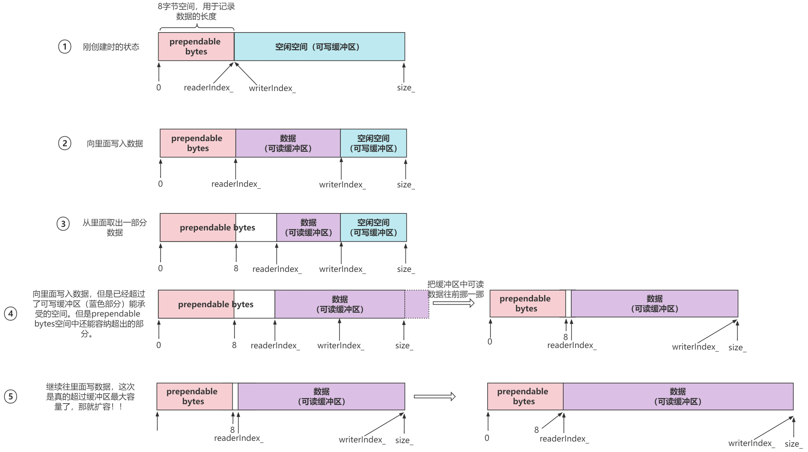
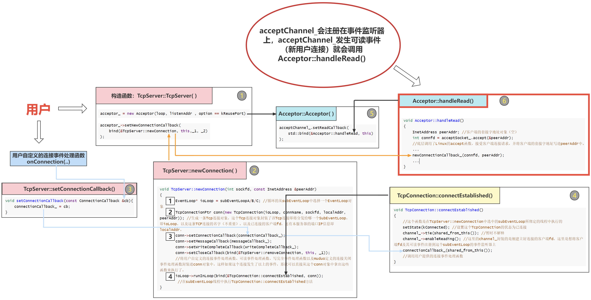

# 概述

重构并剖析了 muduo 库中的核心部分, 即 Multi-Reactor 架构部分, 具体细分有以下几个模块:

- 网络相关模块: 如 Socket、InetAddress、TcpConnection、Acceptor、TcpServer 等
- 事件循环相关模块: 如 EventLoop、Channel、Poller、EPollPoller 等
- 线程相关模块: 如 Thread、EventLoopThread、EventLoopThreadPool 等
- 基础模块: 如用户态缓冲区 Buffer、时间戳 Timestamp、日志类 Logger 等

### 1. Multi-Reactor 概述

muduo 库是基于 Reactor 模式实现的 TCP 网络编程库。后续篇幅都是围绕 Multi-reactor 模型进行展开。Multi-Reactor 模型如下所示：


### 2. Multi-Reactor 架构三大核心模块介绍

muduo 库有三个核心组件支撑一个 Reactor 实现持续的监听一组 fd，并根据每个 fd 上发生的事件调用相应的处理函数。
这三个组件分别是 Channel 类、Poller/EpollPoller 类以及 EventLoop 类。

#### 2.1 Channel

`Channel类`**其实相当于一个文件描述符的保姆，它将文件描述符及该文件描述符对应的回调函数绑定在一起。**
在 TCP 网络编程中，想要 IO 多路复用监听某个文件描述符，就要把这个 fd 和该 fd 感兴趣的事件通过`epoll_ctl`注册到 IO 多路复用模块(事件监听器)上。当事件监听器监听到该 fd 发生了某个事件。事件监听器返回发生事件的 fd 集合以及每个 fd 都发生了什么事件。
`Channel类`则封装了一个 fd 和这个 fd 感兴趣事件以及事件监听器监听到该 fd 实际发生的事件。同时`Channel类`还提供了设置该 fd 的感兴趣事件, 以及将该 fd 及其感兴趣事件注册到事件监听器或从事件监听器上移除, 以及保存了该 fd 的每种事件对应的处理函数。
`Channel类`有以下几个重要成员变量:

- fd\_: 这个`Channel`对象照看的文件描述符;
- int events\_: 代表 fd`感兴趣`的事件类型集合;
- int revents\_ : 代表事件监听器`实际监听`到该 fd 发生的事件类型集合, 当事件监听器监听到一个 fd 发生了什么事件，通过`Channel::set_revents()`函数来设置`revents`值;
- EventLoop* loop: 这个 fd 属于哪个 EventLoop 对象, 这个暂时不解释;
- read*callback*、write*callback*、close*callback*、error*callback*: 这些是`std::function`类型, 代表着这个`Channel`为这个文件描述符保存的各事件类型发生时的处理函数。比如这个 fd 发生了可读事件, 需要执行可读事件处理函数, 这时候`Channel类`都替你保管好了这些可调用函数, 真是贴心啊, 要用执行的时候直接管保姆要就可以了;

##### Channel 类的重要成员方法：

##### 向 Channel 对象注册各类事件的处理函数：

```
void setReadCallback(ReadEventCallback cb) {read_callback_ = std::move(cb);}
void setWriteCallback(Eventcallback cb) {write_callback_ = std::move(cb);}
void setCloseCallback(EventCallback cb) {close_callback_ = std::move(cb);}
void setErrorCallback(EventCallback cb) {error_callback_ = std::move(cb);}
```

一个文件描述符会发生可读、可写、关闭、错误事件。当发生这些事件后，就需要调用相应的处理函数来处理。外部通过调用上面这四个函数可以将事件处理函数放进`Channel类`中, 当需要调用的时候就可以直接拿出来调用了。

##### 将 Channel 中的文件描述符及其感兴趣事件注册事件监听器上或从事件监听器上移除：

```
void enableReading() {events_ |= kReadEvent; upadte();}
void disableReading() {events_ &= ~kReadEvent; update();}
void enableWriting() {events_ |= kWriteEvent; update();}
void disableWriting() {events_ &= ~kWriteEvent; update();}
void disableAll() {events_ |= kNonEvent; update();}
```

外部通过这几个函数来告知`Channel`你所监管的文件描述符都对哪些事件类型感兴趣, 并把这个文件描述符及其感兴趣事件注册到事件监听器（IO 多路复用模块）上。这些函数里面都有一个`update()`私有成员方法, 这个 update 其实本质上就是调用了`epoll_ctl()`。

- int set*revents(int revt) {revents* = revt;} 当事件监听器监听到某个文件描述符发生了什么事件, 通过这个函数可以将这个文件描述符实际发生的事件封装进这个 Channel 中。
- void handleEvent(TimeStamp receive*time) 当调用`epoll_wait()`后, 可以得知事件监听器上哪些 Channel（文件描述符）发生了哪些事件，事件发生后自然就要调用这些 Channel 对应的处理函数。 `Channel::handleEvent`, 让每个发生了事件的 Channel 调用自己保管的事件处理函数。每个 Channel 会根据自己文件描述符实际发生的事件（通过`Channel`中的```revents*`变量得知）和感兴趣的事件（通过`Channel`中的`events*`变量得知）来选择调用`read_callback*`或`write*callback*`和`close*callback*`和`error*callback*```。

#### 2.2. Poller / EPollPoller

- 负责`监听`文件描述符事件是否触发以及返回发生事件的文件描述符以及具体事件的模块就是`Poller`。
- 所以一个`Poller`对象对应一个事件监听器(这里我不确定要不要把`Poller`就当作事件监听器)。
- 在 Multi-Reactor 模型中, 有多少`Reactor`就有多少`Poller`。
  muduo 提供了`epoll`和`poll`两种 IO 多路复用方法来实现事件监听。不过默认是使用 epoll 来实现，也可以通过选项选择`poll`。但是我自己重构的 muduo 库只支持`epoll`。
- `Poller`是个抽象虚类,由`EpollPoller`和`PollPoller`继承实现(陈硕的 muduo 网络库中除此之外基本都是基于对象的编程风格, 只有这里通过采用面向对象的方式，`Poller`实际上是一个抽象类,`EpollPoller`才是对`Poller`的具体实现，也是对`epoll`的具体封装), 与监听文件描述符和返回监听结果的具体方法也基本上是在这两个派生类中实现。
- `EpollPoller`就是封装了用`epoll`方法实现的与事件监听有关的各种方法
- `PollPoller`就是封装了`poll`方法实现的与事件监听有关的各种方法。
- 以后谈到`Poller`希望大家都知道我说的其实是`EpollPoller`。

##### Poller/EpollPoller 的重要成员变量：

- `epollfd_`: 就是`epoll_create`方法返回的`epoll`句柄。
- `channels_`: 这个变量是`std::unordered_map<int, Channel*>`类型，负责记录文件描述符 fd 到 Channel 的映射，也帮忙保管所有注册在你这个`Poller`上的`Channel`。
- `ownerLoop_`: 所属的`EventLoop`对象，看到后面你懂了。

##### EpollPoller 给外部提供的最重要的方法：

- `TimeStamp poll(int timeoutMs, ChannelList *activeChannels)`: 这个函数可以说是`Poller的核心`了，当外部调用`poll`方法的时候，该方法底层其实是通过`epoll_wait`获取这个事件监听器上发生事件的 fd 及其对应发生的事件，我们知道每个 fd 都是由一个`Channel`封装的，通过哈希表`channels_`可以根据 fd 找到封装这个 fd 的`Channel`。将事件监听器监听到该 fd 发生的事件写进这个 Channel 中的 revents 成员变量中。然后把这个 Channel 装进`activeChannels`中(它是一个 vector<Channel\*>)。这样，当外界调用完 poll 之后就能拿到事件监听器的监听结果(`activeChannels_`), 【后面会经常提到这个`监听结果`这四个字，希望你明白这代表什么含义】

#### 2.3. EventLoop

刚才的`Poller`是封装了和事件监听有关的方法和成员, 调用一次`Poller::poll`方法它就能给你返回事件监听器的监听结果(发生事件的 fd 及其发生的事件)。作为一个网络服务器, 需要有`持续监听`、`持续获取监听结果`、`持续处理监听结果对应的事件`的能力, 也就是我们需要**循环的去调用 Poller::poll 方法获取实际发生事件的 Channel 集合, 然后调用这些 Channel 里面保管的不同类型事件的处理函数(调用 Channel::handleEvent 方法)。**

- `EventLoop`就是负责实现"循环", 负责驱动"循环"的重要模块! `Channel`和`Poller`其实相当于`EventLoop`的手下.
- `EventLoop`整合封装了二者并向上提供了更方便的接口来使用.

##### 2.3.1. 全局概览 Poller、Channel 和 EventLoop 在整个 Multi-Reactor 通信架构中的角色

- EventLoop 起到一个驱动循环的功能;
- Poller 负责从事件监听器上获取监听结果;
- Channel 类则在其中起到了将 fd 及其相关属性封装的作用, 将 fd 及其感兴趣事件和发生的事件以及不同事件对应的回调函数封装在一起, 这样在各个模块中传递更加方便;
- 接着 EventLoop 调用;


另外上面这张图没有画出 Acceptor，因为 Acceptor 和 EventLoop 和 Poller 之间有点错杂，可能画出来效果不好。

##### 2.3.2. One Loop Per Thread 含义介绍

有没有注意到上面图中,每一个 EventLoop 都绑定了一个线程(一对一绑定), 这种运行模式是 muduo 库的特色! 充份利用了多核 CPU 的能力, 每一个核的线程负责循环监听一组文件描述符的集合。至于这个 One Loop Per Thread 是怎么实现的, 后面还会交代。

##### 2.3.3. EventLoop 重要方法 EventLoop::loop()

我将 EventLoop 核心逻辑给出，省略了非核心代码：

```
void EventLoop::loop() { // EventLoop 所属线程执行
    while (!quit_) {
        activeChannels_.clear();
        //此时activeChannels已经填好了事件发生的channel
        pollReturnTime_ = poller_->poll(kPollTimeMs, &activeChannels_);

        for(Channel *channel : activeChannels_)
            channel->handleEvent(pollReturnTime_);
    }
    LOG_INFO("EventLoop %p stop looping. \n", t_loopInThisThread);
}
```

每个`EventLoop`对象都唯一绑定了一个线程,这个线程其实就在一直执行这个函数里面的 while 循环,这个 while 循环的大致逻辑比较简单。就是调用`Poller::poll`方法获取事件监听器上的监听结果。接下来在`loop`里面就会调用监听结果中每一个`Channel`的处理函数`handleEvent()`。每一个`Channel`的处理函数会根据`Channel类`中封装的实际发生的事件, 执行`Channel类`中封装的各事件处理函数。(比如一个`Channel`发生了可读事件, 可写事件, 则这个`Channel`的`handleEvent()`就会调用提前注册在这个`Channel`的可读事件和可写事件处理函数, 又比如另一个`Channel`只发生了可读事件, 那么`handleEvent()`就只会调用提前注册在这个`Channel`中的可读事件处理函数)。上面讲`Channel`时也提到了`Channel`对应的四种事件处理函数(回调函数): `读回调函数setReadCallback`、`写回调函数setWriteCallback`、`关闭回调函数setCloseCallback`、`错误回调函数setErrorCallback`等四种回调函数。

看完上面的代码，感受到 EventLoop 的主要功能了吗?其实 EventLoop 所做的事情就是: **持续循环的获取监听结果并且根据结果调用处理函数。**

### 3. 其他主要类介绍

#### 3.1. Acceptor 类

- Acceptor 用于接受新用户连接并分发连接给`SubReactor(Sub EventLoop)`, 封装了服务器监听套接字 fd 以及相关处理方法。
- Acceptor 类内部其实没有贡献什么核心的处理函数, 主要是对其他类的方法调用进行封装。但是`Acceptor`中核心的点在于将监听套接字和`Channel`绑定在了一起, 并为其注册了读回调`handRead`。
- 当有连接到来的时候, 读事件发生, 就会调用相应读回调`handleRead`, 读回调会间接调用 TcpServer 的`newConnection()`, 该函数负责以轮询的方式把连接分发给`sub EventLoop`去处理。

#### 3.1.1. Acceptor 封装的重要成员变量：

- ```acceptSocket _```: 这个是服务器监听套接字的文件描述符, 即`socket`套接字返回的监听套接字;
- ```acceptChannel*```: 这是个`Channel`类, 把```acceptSocket*```及其感兴趣事件和事件对应的处理函数都封装进去;
- ```EventLoop * loop```: 监听套接字的 fd 由哪个`EventLoop`负责循环监听以及处理相应事件, 其实这个`EventLoop`就是 main EventLoop;
- ```newConnectionCallbac_```: `TcpServer`构造函数中将`TcpServer::newConnection()`函数注册给了这个成员变量。这个`TcpServer::newConnection`函数的功能是公平的选择一个 subEventLoop, 并把已经接受的连接分发给这个`subEventLoop`;

#### 3.1.2. Acceptor 封装的重要成员方法：

- ```listen()```: 该函数底层调用了 linux 的函数`listen()`，开启对`acceptSocket_`的监听同时将`acceptChannel`及其感兴趣事件（可读事件）注册到`main EventLoop`的事件监听器上。换言之就是让`main EventLoop`事件监听器去监听`acceptSocket_`。
- ```handleRead()```: 这是一个私有成员方法, 这个方法是要注册到`acceptChannel_`上的, 同时`handleRead()`方法内部还调用了成员变量`newConnectionCallback_`保存的函数。当`main EventLoop`监听到`acceptChannel_`上发生了可读事件时(新用户连接事件), 就是调用这个`handleRead()`方法。
- 简单说一下这个`handleRead()`最终实现的功能是什么, 接受新连接, 并且以负载均衡的选择方式选择一个`sub EventLoop`, 并把这个新连接分发到这个`subEventLoop`上, 这里是需要理解的重点。

#### 3.2. Socket 类

```
#pragma once
#include "noncopyable.h"
class InetAddress;
// 封装socket fd
class Socket : noncopyable
{
public:
    explicit Socket(int sockfd)
        : sockfd_(sockfd)
    {
    }
    ~Socket();

    int fd() const { return sockfd_; }
    //调用bind绑定服务器IP和端口
    void bindAddress(const InetAddress &localaddr); 
    //调用listen监听套接字
    void listen(); 
    int accept(InetAddress* peeraddr); //调用accept接收新客户连接请求 只不过这里封装的是accept4
    void shutdownWrite(); //调用shutdown关闭服务端写通道
	/* 下面四个函数都是调用setsockopt来设置一些socket选项 */
    void setTcpNoDelay(bool on); //不启动naggle算法, 增大对小数据包的支持
    void setReuseAddr(bool on);
    void setReusePort(bool on);
    void setKeepAlive(bool on); //服务器监听套接字文件描述符

private:
    const int sockfd_;
};
```
### 3.3. Buffer类
Buffer类其实是封装了一个用户缓冲区，以及向这个缓冲区写数据读数据等一系列控制方法。

#### 3.3.1. Buffer类主要设计思想(读写配合，缓冲区内部调整以及动态扩容)

我个人觉得这个缓冲区类的实现值得参考和借鉴，以前自己写的只支持一次性全部读出和写入, 而这个Buffer类可以读一点, 写一点, 内部逻辑稳定。**这个Buffer类是vector(方便动态扩容),对外表现出std::queue的特性, 它的内部原理大概就是下图这样子的, 用两个游标(```readerIndex_```和```writerIndex_```)标记可读缓冲区的起始位置和空闲空间的起始位置。**

**
其中需要关注的一个思想就是, 随着写入数据和读入数据, 蓝色的空闲空间会越来越少, prependable空间会越来越大, 当什么时候空用空间耗尽了, 就会像步骤4一样, 把所有数据拷贝前移, 重新调整。另外当整个缓冲区的prependable空间和蓝色的空闲空间都无法装下新来的数据时, 那就会调用```vector```的```resize```, 实现扩容机制。**


#### 3.3.2. 重要的成员函数：
```
- append(const char* data, size_t len): 将data数据添加到缓冲区中。
- retrieveAsString(size_t len): 获取缓冲区中长度为len的数据,并以string返回。
- retrieveAllString(): 获取缓冲区所有数据,并以string返回。
- ensureWritableByts(size_t len): 当你打算向缓冲区写入长度为len的数据之前,先调用这个函数,这个函数会检查你的缓冲区可写空间能不能装下长度为len的数据,如果不能,就进行动态扩容操作。
```
下面两个方法主要是封装了调用了上面几个方法: 
```
- ssize_t Buffer::readFd(int fd, int* saveErrno): 客户端发来数据,readFd从该TCP接收缓冲区中将数据读出来并放到Buffer中。
- ssize_t Buffer::writeFd(int fd, int* saveErrno): 服务端要向这条TCP连接发送数据,通过该方法将Buffer中的数据拷贝到TCP发送缓冲区中。
- 其实readFd和writeFd函数的设计还有一些值得讨论的地方, 这个放在以后讨论
```

### 3.4. TcpConnection类
在上面讲```Acceptor```的时候提到了这个```TcpConnection类```。这个类主要封装了一个已建立的TCP连接，以及控制该TCP连接的方法（连接建立和关闭和销毁）, 以及该连接发生的各种事件（读/写/错误/连接）对应的处理函数，以及这个TCP连接的服务端和客户端的套接字地址信息等。

我个人觉得```TcpConnection类```和```Acceptor类```是兄弟关系，```Acceptor```用于```main EventLoop```中，对服务器监听套接字fd及其相关方法进行封装（监听、接受连接、分发连接给```Sub EventLoop```等）, ```TcpConnection```用于```Sub EventLoop```中, 对连接套接字fd及其相关方法进行封装（读消息事件、发送消息事件、连接关闭事件、错误事件等）。
#### 3.4.1. TcpConnection的重要变量: 

- socket_: 用于保存已连接套接字文件描述符。
- channel_: 封装了上面的socket_及其各类事件的处理函数(读、写、错误、关闭等事件处理函数)。这个Channel中保存的各类事件的处理函数是在TcpConnection对象构造函数中注册的。
- loop_: 这是一个```EventLoop* ```类型, 该Tcp连接的```Channel```注册到了哪一个```sub EventLoop```上。这个loop_就是那一个```sub EventLoop```。
- inputBuffer_: 这是一个```Buffer类```, 是该TCP连接对应的用户接收缓冲区。
- outputBuffer_: 也是一个```Buffer类```, 不过是用于暂存那些暂时发送不出去的待发送数据。因为Tcp发送缓冲区是有大小限制的, 假如达到了高水位线，就没办法把发送的数据通过send()直接拷贝到Tcp发送缓冲区, 而是暂存在这个- outputBuffer_中, 等TCP发送缓冲区有空间了, 触发可写事件了, 再把outputBuffer_中的数据拷贝到Tcp发送缓冲区中。
- state_: 这个成员变量标识了当前TCP连接的状态(Connected、Connecting、Disconnecting、Disconnected)
connetionCallback_、messageCallback_、writeCompleteCallback_、closeCallback_：用户会自定义 [连接建立/关闭后的处理函数] 、[收到消息后的处理函数]、[消息发送完后的处理函数]以及Muduo库中定义的[连接关闭后的处理函数]。这四个函数都会分别注册给这四个成员变量保存。

#### 3.4.2. TcpConnection的重要成员方法：

```handleRead()```、```handleWrite()```、```handleClose()```、```handleError()```: 这四个函数都是私有成员方法，在一个已经建立好的TCP连接上主要会发生四类事件：可读事件、可写事件、连接关闭事件、错误事件。当事件监听器监听到一个连接发生了以上的事件，那么就会在```EventLoop```中调用这些事件对应的处理函数，同时```accept```返回已连接套接字所绑定的```Channel```中注册了这四种回调函数。
- ```handleRead()```: 负责处理TCP连接的可读事件, 它会将客户端发送来的数据拷贝到用户缓冲区中(inputBuffer_), 然后再调用```connectionCallback_```保存的连接建立后的处理函数```messageCallback_```。这个messageCallback_由上层用户注册, 之后muduo库会在T```cpServer中```会对其设置。
- ```handleWrite()```: 负责处理Tcp连接的可写事件。这个函数的情况有些复杂，留到下一篇讲解。
- ```handleClose()```: 负责处理Tcp连接关闭的事件。大概的处理逻辑就是将这个```TcpConnection```对象中的```channel_```从事件监听器中移除。然后调用```connectionCallback_```和```closeCallback_```保存的回调函数。这```closeCallback_```中保存的函数是由muduo库提供的, ```connectionCallback_```保存的回调函数则由用户提供的(可有可无其实)。

# 主线篇


TCP网络编程的本质其实是处理下面这几个事件：

连接的建立。
连接的断开：包括主动断开和被动断开。
消息到达，客户端连接文件描述符可读。
消息发送，向客户端连接文件描述符写数据。
所以我们这一篇内容也是围绕上面四个主线展开！

### 1. 用muduo库实现简易echo服务器
```
/*
muduo网络库给用户提供了两个主要类
TcpServer: 用于编写服务器程序
TcpClient: 用于编写客户端程序

epoll+线程池
好处: 能够把网络I/O代码和业务代码分开, 业务代码主要是"用户的连接和断开, "用户的可读写事件"

*/

#include <muduo/net/TcpServer.h>
#include <muduo/net/EventLoop.h>
#include <iostream>
#include <functional>
#include <string>
using namespace std;
using namespace muduo;
using namespace muduo::net;
using namespace placeholders;

/*基于muduo网络库开发服务器程序
1.组合TcpServer对象
2.创建EventLoop事件循环对象的指针
3.明确TcpServer构造函数需要什么参数, 输出MyTcpServer的构造函数
4.在当前服务器类的构造函数当中, 注册处理连接的回调函数和处理读写事件的回调函数
5.设置合适的服务端线程数量, muduo库会自己分配IO线程和worker线程
*/
class MyTcpServer
{
public://#3
    MyTcpServer(EventLoop *loop,               // 事件循环, Reactor,
               const InetAddress &listenAddr, // IP+PORT
               const string &nameArg          // 服务器的名字
               ) : _server(loop, listenAddr, nameArg)
    {
        //#4 给服务器注册用户连接的创建和断开回调
        _server.setConnectionCallback(std::bind(&MyTcpServer::onConnection, this, _1));

        //#4  给服务器注册用户读写事件回调
        _server.setMessageCallback(std::bind(&MyTcpServer::onMessage, this, _1, _2, _3));

        //#5 设置服务器端的线程数量 1个IO + 3个worker线程
        _server.setThreadNum(4);
    }
    // 开启事件循环
    void start()
    {
        _server.start();
    }

private:
    // 专门处理用户的连接创建和断开  epoll clientfd accept
    void onConnection(const TcpConnectionPtr &conn)
    {
        if (conn->connected())
        {
            cout << conn->peerAddress().toIpPort() << "->" << conn->localAddress().toIpPort() << "state:online" << endl;
        }
        else
        {
            cout << conn->peerAddress().toIpPort() << "->" << conn->localAddress().toIpPort() << "state:offline" << endl;
            conn->shutdown(); // close(fd)
            //_loop->quit();
        }
    }

    // 专门处理用户的读写事件
    void onMessage(const TcpConnectionPtr &conn, // 连接
                   Buffer *buffer,               // 缓冲区
                   Timestamp time)               // 接收到数据的时间信息

    {
        string buf = buffer->retrieveAllAsString();
        cout << "recv buff:" << buf << "time:" << time.toString() << endl;
        conn->send(buf);
    }
    TcpServer _server; // #1
    EventLoop *_loop;  // #2  epoll
};

int main()
{
    EventLoop loop;
    InetAddress addr("127.0.0.1", 6000);
    MyTcpServer server(&loop, addr, "MyTcpServer");

    server.start(); // listenfd epoll_ctl=>epoll
    loop.loop();    // epoll_wait, 以阻塞方式等待用户的连接, 已连接用户的读写操作等。
    return 0;
}
```
### 2. 建立连接
#### 2.1. 连接建立的代码逻辑



注意下面的标号分别对应上图中的代码方框标号！！

#### 1: TcpServer::TcpServer()
- 当我们创建一个TcpServer对象, 即执行代码TcpServer server(&loop, listenAddr);调用了TcpServer的构造函数, TcpServer构造函数最主要的就是类的内部实例化了一个Acceptor对象, 并往这个Acceptor对象注册了一个回调函数TcpServer::newConnection()。

#### 5: Acceptor::Acceptor()
- 当我们在TcpServer构造函数实例化Acceptor对象时, Acceptor的构造函数中实例化了一个Channel对象, 即acceptChannel_, 该Channel对象封装了服务器监听套接字文件描述符(尚未注册到main EventLoop的事件监听器上)。接着Acceptor构造函数将Acceptor::handleRead()方法注册进acceptChannel_中, 这也意味着, 日后如果事件监听器监听到acceptChannel_发生可读事件, 将会调用Acceptor::handleRead()函数。

至此，TcpServer对象创建完毕，用户调用TcpServer::start()方法，开启TcpServer。我们来直接看一下TcpServer::start()方法都干了什么，我省略了一些非核心的代码: 
```
/******** TcpServer.cc *********/
void TcpServer::start() // 开启服务器监听
{
        loop_->runInLoop(std::bind(&Acceptor::listen, acceptor_.get()));
}

/******** Acceptor.cc  *********/
void Acceptor::listen()
{
    listenning_ = true;
    acceptSocket_.listen();         // listen
    acceptChannel_.enableReading(); // acceptChannel_注册至Poller !重要
}
```
其实就是将其实主要就是调用Acceptor::listen()函数(底层是调用了linux的函数listen())监听服务器套接字，以及将acceptChannel_注册到main EventLoop的事件监听器上监听它的可读事件(新用户连接事件)
接着用户调用loop.loop()，即调用了EventLoop::loop()函数，该函数就会循环的获取事件监听器的监听结果，并且根据监听结果调用注册在事件监听器上的Channel对象的事件处理函数。

#### 6: Acceptor::handleRead()
- 当程序如果执行到了这个函数里面,说明acceptChannel_发生可读事件,程序处理新客户连接请求。该函数首先调用了Linux的函数accept()接受新客户连接。接着调用了TcpServer::newConnection()函数,这个函数是在步骤1中注册给Acceptor并由成员变量newConnectionCallback_保存。

#### 7: TcpServer::newConnection()
- 该函数的主要功能就是将建立好的连接进行封装(封装成TcpConnection对象),并使用选择算法公平的选择一个sub EventLoop,并调用TcpConnection::connectEstablished()将TcpConnection::channel_注册到刚刚选择的sub EventLoop上。

#### 2.2. 编程细节启发，什么时候用智能指针管理对象最合适！

在一些情况下使用智能指针会带来额外的性能开销，所以不能无脑梭哈。但是智能指针又能保护内存安全。这里的编程细节也给了我一些启发。来看下下面的核心逻辑代码，非核心以删除: 
```
/******** Callbacks.h  ********/
using TcpConnectionPtr = std::shared_ptr<TcpConnection>;
/******** TcpServer.cc ********/
void TcpServer::newConnection(int sockfd, const InetAddress &peerAddr)
{
    TcpConnectionPtr conn(new TcpConnection(ioLoop,
                                            connName,
                                            sockfd,
                                            localAddr,
                                            peerAddr));
    connections_[connName] = conn;
    ioLoop->runInLoop(
        std::bind(&TcpConnection::connectEstablished, conn));
}
```

在```TcpServer::newConnection()```函数中，当接受了一个新用户连接，就要把这个Tcp连接封装成一个```TcpConnection```对象，也就是上面代码中的```new TcpConnection(…)```。然后用一个共享型智能指针来管理这个对象。所以为什么这里要把```TcpConnection```用智能指针来管理啊？

这里使用智能指针管理TcpConnection的最重要原因在于防止指针悬空，而指针悬空可能会来自以下这三个方面：

- 1、TcpConnection会和用户直接交互，用户可能会手欠删除。在我们编写服务器的时候，我们用户可以自定义连接事件发生后的处理函数（如下所示），并将这个函数注册到TcpServer中。
```
/**** 用户自定义的连接事件发生后的处理函数 *****/
void onConnection(const TcpConnectionPtr &conn)
{
    ...
}
```
** 假如这里的onConnection函数传入的是TcpConnection而不是TcpConnectionPtr，用户在onConnection函数中把TcpConnection对象给delete了怎么办？删除了之后，程序内部还要好几处地方都在使用TcpConnection对象。结果这个对象的内存突然消失了，服务器访问非法内存崩溃。虽然这一系列连锁反应会让人觉得用户很笨。但是作为设计者的我们必须要保证，编程设计不可以依赖用户行为，一定要尽可能地封死用户的误操作。所以这里用了共享智能指针。**

- 2、TcpConnection对象的多线程安全问题: 
假如服务器要关闭了，这个时候Main EventLoop线程中的TcpServer::~TcpServer()函数开始把所有TcpConnection对象都删掉。那么其他线程还在使用这个TcpConnection对象，如果你把它的内存空间都释放了，其他线程访问了非法内存，会直接崩溃。
你可能会觉得，反正我都要把服务器给关了，崩就崩了吧。这种想法是错的！因为可能在你关闭服务器的时候，其他线程正在处理TcpConnection的发送消息任务，这个时候你应该等它发完才释放TcpConnection对象的内存才对！

第三种情况我们留到将连接关闭的时候再来讨论，这一部分也是有很好的编程启发的！


