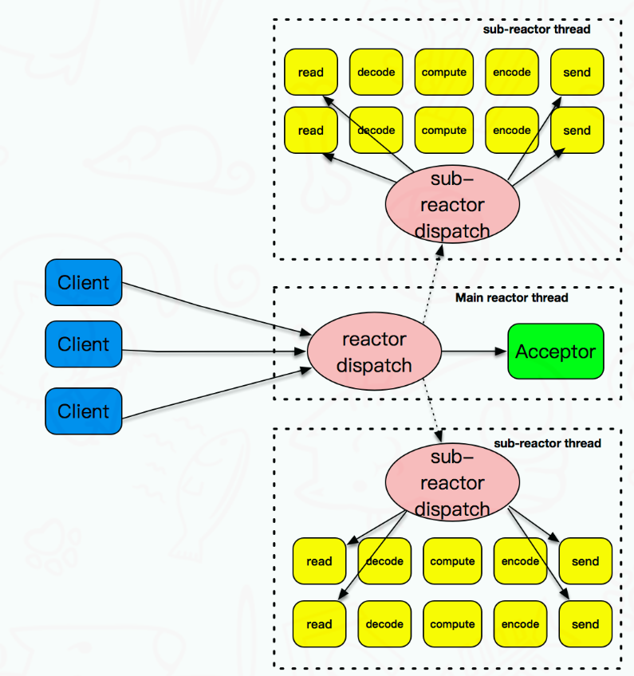
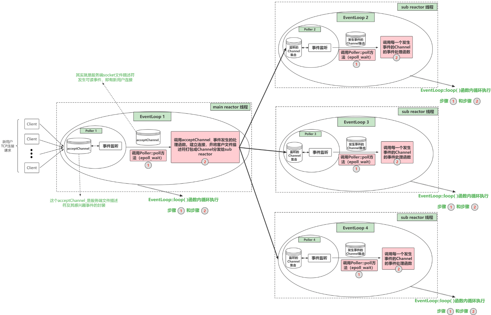

重构并剖析了muduo库中的核心部分，即Multi-Reactor架构部分，具体细分有以下几个模块：
- 网络相关模块：如Socket、InetAddress、TcpConnection、Acceptor、TcpServer等
- 事件循环相关模块：如EventLoop、Channel、Poller、EPollPoller等
- 线程相关模块：如Thread、EventLoopThread、EventLoopThreadPool等
- 基础模块：如用户态缓冲区Buffer、时间戳Timestamp、日志类Logger等
### 1. Multi-Reactor概述
muduo库是基于Reactor模式实现的TCP网络编程库。后续篇幅都是围绕Multi-reactor模型进行展开。Multi-Reactor模型如下所示：


### 2. Multi-Reactor架构三大核心模块介绍
muduo库有三个核心组件支撑一个Reactor实现持续的监听一组fd，并根据每个fd上发生的事件调用相应的处理函数。
这三个组件分别是Channel类、Poller/EpollPoller类以及EventLoop类。

#### 2.1 Channel
```Channel类```其实相当于一个文件描述符的保姆，它将文件描述符及该文件描述符对应的回调函数绑定在一起。
在TCP网络编程中，想要IO多路复用监听某个文件描述符，就要把这个fd和该fd感兴趣的事件通过```epoll_ctl```注册到IO多路复用模块(事件监听器)上。当事件监听器监听到该fd发生了某个事件。事件监听器返回发生事件的fd集合以及每个fd都发生了什么事件。
```Channel类```则封装了一个fd和这个fd感兴趣事件以及事件监听器监听到该fd实际发生的事件。同时```Channel类```还提供了设置该fd的感兴趣事件, 以及将该fd及其感兴趣事件注册到事件监听器或从事件监听器上移除, 以及保存了该fd的每种事件对应的处理函数。
```Channel类```有以下几个重要成员变量: 
- fd_: 这个```Channel```对象照看的文件描述符;
- int events_: 代表fd```感兴趣```的事件类型集合;
- int revents_ : 代表事件监听器```实际监听```到该fd发生的事件类型集合, 当事件监听器监听到一个fd发生了什么事件，通过```Channel::set_revents()```函数来设置```revents```值;
- EventLoop* loop: 这个fd属于哪个EventLoop对象, 这个暂时不解释;
- read_callback_、write_callback_、close_callback_、error_callback_: 这些是```std::function```类型, 代表着这个```Channel```为这个文件描述符保存的各事件类型发生时的处理函数。比如这个fd发生了可读事件, 需要执行可读事件处理函数, 这时候```Channel类```都替你保管好了这些可调用函数, 真是贴心啊, 要用执行的时候直接管保姆要就可以了;
##### Channel类的重要成员方法：
##### 向Channel对象注册各类事件的处理函数：
```
void setReadCallback(ReadEventCallback cb) {read_callback_ = std::move(cb);}
void setWriteCallback(Eventcallback cb) {write_callback_ = std::move(cb);}
void setCloseCallback(EventCallback cb) {close_callback_ = std::move(cb);}
void setErrorCallback(EventCallback cb) {error_callback_ = std::move(cb);}
```
一个文件描述符会发生可读、可写、关闭、错误事件。当发生这些事件后，就需要调用相应的处理函数来处理。外部通过调用上面这四个函数可以将事件处理函数放进```Channel类```中, 当需要调用的时候就可以直接拿出来调用了。

##### 将Channel中的文件描述符及其感兴趣事件注册事件监听器上或从事件监听器上移除：
```
void enableReading() {events_ |= kReadEvent; upadte();}
void disableReading() {events_ &= ~kReadEvent; update();}
void enableWriting() {events_ |= kWriteEvent; update();}
void disableWriting() {events_ &= ~kWriteEvent; update();}
void disableAll() {events_ |= kNonEvent; update();}
```

外部通过这几个函数来告知```Channel```你所监管的文件描述符都对哪些事件类型感兴趣, 并把这个文件描述符及其感兴趣事件注册到事件监听器（IO多路复用模块）上。这些函数里面都有一个```update()```私有成员方法, 这个update其实本质上就是调用了```epoll_ctl()```。

- int set_revents(int revt) {revents_ = revt;} 当事件监听器监听到某个文件描述符发生了什么事件, 通过这个函数可以将这个文件描述符实际发生的事件封装进这个Channel中。
- void handleEvent(TimeStamp receive_time) 当调用```epoll_wait()```后, 可以得知事件监听器上哪些Channel（文件描述符）发生了哪些事件，事件发生后自然就要调用这些Channel对应的处理函数。 ```Channel::handleEvent```, 让每个发生了事件的Channel调用自己保管的事件处理函数。每个Channel会根据自己文件描述符实际发生的事件（通过```Channel```中的```revents_```变量得知）和感兴趣的事件（通过```Channel```中的```events_```变量得知）来选择调用```read_callback_```或```write_callback_```和```close_callback_```和```error_callback_```。

#### 2.2. Poller / EPollPoller
- 负责```监听```文件描述符事件是否触发以及返回发生事件的文件描述符以及具体事件的模块就是```Poller```。
- 所以一个```Poller```对象对应一个事件监听器(这里我不确定要不要把```Poller```就当作事件监听器)。
- 在Multi-Reactor模型中, 有多少```Reactor```就有多少```Poller```。
muduo提供了```epoll```和```poll```两种IO多路复用方法来实现事件监听。不过默认是使用epoll来实现，也可以通过选项选择```poll```。但是我自己重构的muduo库只支持```epoll```。
- ```Poller```是个抽象虚类,由```EpollPoller```和```PollPoller```继承实现(陈硕的muduo网络库中除此之外基本都是基于对象的编程风格, 只有这里通过采用面向对象的方式，```Poller```实际上是一个抽象类,```EpollPoller```才是对```Poller```的具体实现，也是对```epoll```的具体封装), 与监听文件描述符和返回监听结果的具体方法也基本上是在这两个派生类中实现。
- ```EpollPoller```就是封装了用```epoll```方法实现的与事件监听有关的各种方法
- ```PollPoller```就是封装了```poll```方法实现的与事件监听有关的各种方法。
- 以后谈到```Poller```希望大家都知道我说的其实是```EpollPoller```。

##### Poller/EpollPoller的重要成员变量：

- ```epollfd_```: 就是```epoll_create```方法返回的```epoll```句柄。
- ```channels_```: 这个变量是```std::unordered_map<int, Channel*>```类型，负责记录文件描述符fd到Channel的映射，也帮忙保管所有注册在你这个```Poller```上的```Channel```。
- ```ownerLoop_```: 所属的```EventLoop```对象，看到后面你懂了。

##### EpollPoller给外部提供的最重要的方法：
- ```TimeStamp poll(int timeoutMs, ChannelList *activeChannels)```: 这个函数可以说是```Poller的核心```了，当外部调用```poll```方法的时候，该方法底层其实是通过```epoll_wait```获取这个事件监听器上发生事件的fd及其对应发生的事件，我们知道每个fd都是由一个```Channel```封装的，通过哈希表```channels_```可以根据fd找到封装这个fd的```Channel```。将事件监听器监听到该fd发生的事件写进这个Channel中的revents成员变量中。然后把这个Channel装进```activeChannels```中(它是一个vector<Channel*>)。这样，当外界调用完poll之后就能拿到事件监听器的监听结果(```activeChannels_```), 【后面会经常提到这个```监听结果```这四个字，希望你明白这代表什么含义】

#### 2.3. EventLoop
刚才的```Poller```是封装了和事件监听有关的方法和成员, 调用一次```Poller::poll```方法它就能给你返回事件监听器的监听结果(发生事件的fd 及其发生的事件)。作为一个网络服务器, 需要有```持续监听```、```持续获取监听结果```、```持续处理监听结果对应的事件```的能力, 也就是我们需要<font color=#AEFF7F size=50>循环的去调用Poller::poll方法获取实际发生事件的Channel集合, 然后调用这些Channel里面保管的不同类型事件的处理函数(调用Channel::handleEvent方法)。</font> 

- ```EventLoop```就是负责实现"循环", 负责驱动"循环"的重要模块! ```Channel```和```Poller```其实相当于```EventLoop```的手下.
- ```EventLoop```整合封装了二者并向上提供了更方便的接口来使用.

#####  2.3.1. 全局概览Poller、Channel和EventLoop在整个Multi-Reactor通信架构中的角色
- EventLoop起到一个驱动循环的功能;
- Poller负责从事件监听器上获取监听结果;
- Channel类则在其中起到了将fd及其相关属性封装的作用, 将fd及其感兴趣事件和发生的事件以及不同事件对应的回调函数封装在一起, 这样在各个模块中传递更加方便;
- 接着EventLoop调用;


另外上面这张图没有画出Acceptor，因为Acceptor和EventLoop和Poller之间有点错杂，可能画出来效果不好。
