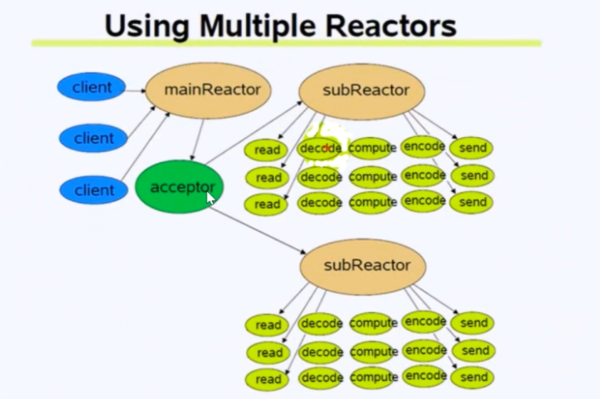
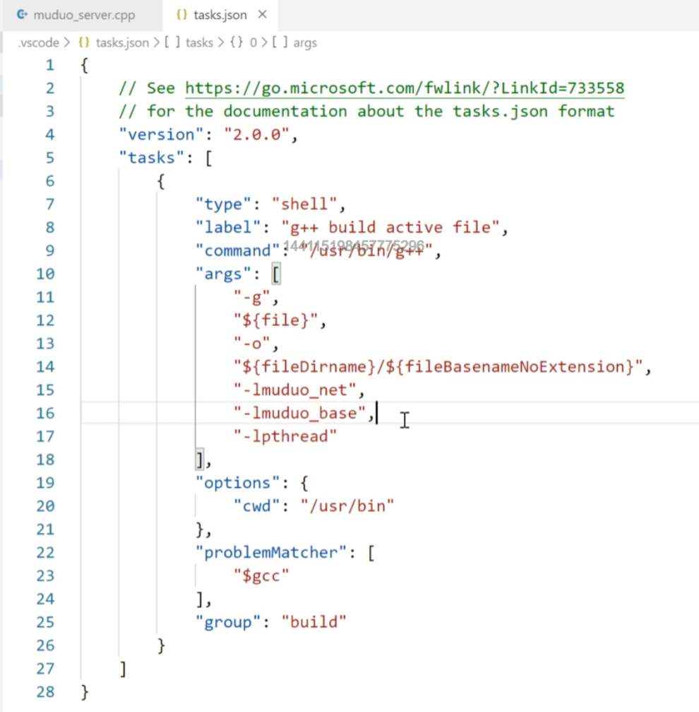

## 基于muduo的客户端服务器编程
### muduo的网络设计: reactors in threads - one loop per thread
- 方案的特点是one loop per thread , 有一个main reactor 负载accept连接, 
然后把连接分发到某个sub reactor(采用round-robin的方式来选择sub reactor),
该连接的所用操作都在那个sub reactor所处的线程中完成。多个连接可能被分派到
多个线程中, 以充分利用CPU.
Reactor poll的大小是固定的，根据CPU的数目确定。
// 设置EventLoop的线程个数，底层通过EventLoopThreadPoo1线程池管理线程类EventLoopThreadserver .setThreadNum(10);

一个Base l0 thread负责accept新的连接，接收到新的连接以后，使用轮询的方式在reactor pool中找到合适的sub reactor将这个连接挂载上去，这个连接上的所有任务都在这个sub reactor上完成。
如果有过多的耗费CPU 1/0的计算任务，可以提交到创建的ThreadPool线程池中专门处理耗时的计算
任务。

### reactors in process - one loop pre process
- nginx服务器的网络模块设计，基于进程设计，采用多个Reactors充当1/0进程和工作进程，通过一把accept锁，完美解决多个Reactors的“惊群现象”

### muduo中的reactor模型
- 事件驱动 (event handling)
- 可以处理一个或多个输入源 (one or more inputs)
- 通过Service Handler同步的将输入事件(Event)采用多路复用分发给相应的RequestHandler(多个)处理

### 服务端编译
- g++ muduo_server.cc -o server -lmuduo_net -lmuduo_base -lpthread
- gcc -I头文件搜索路径 -L库文件搜索路径 -l库名称 
- /usr/include 和/usr/local/include 为默认的文件搜索路径
### telnet作为客户端启动
- telnet 127.0.0.1 6000 

### 编译配置文件
- F1键
- edit(json)  生成c_cpp_properties.json
- 完成配置json文件的配置, 主要是添加"compilerPath": "/usr/bin/gcc"
- Ctrl+Shift+B生成tasks.json文件

