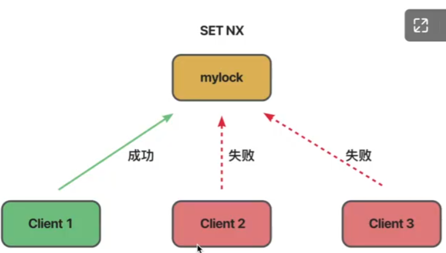
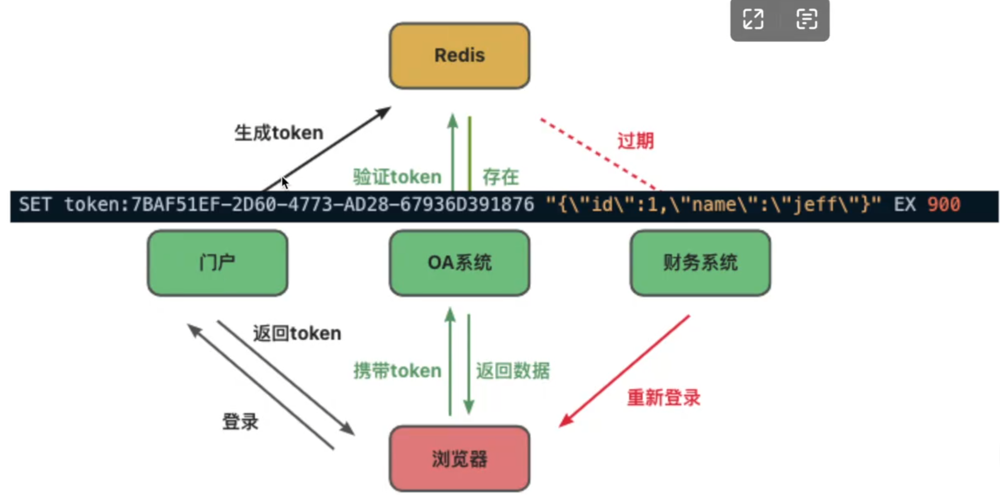
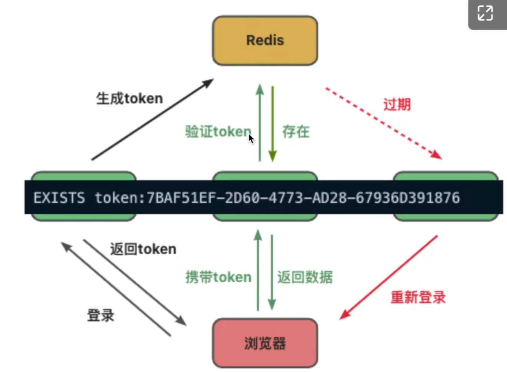
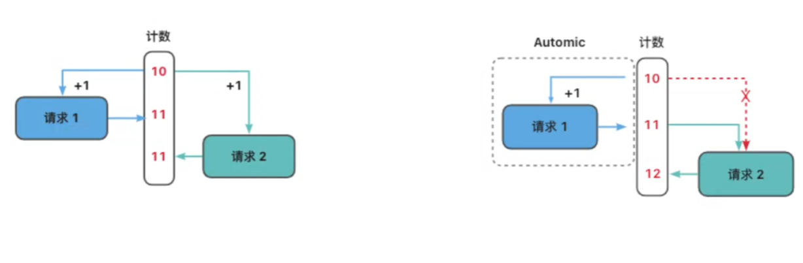
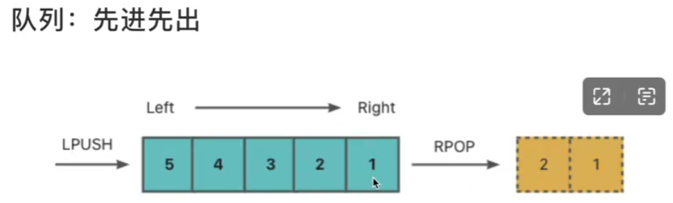
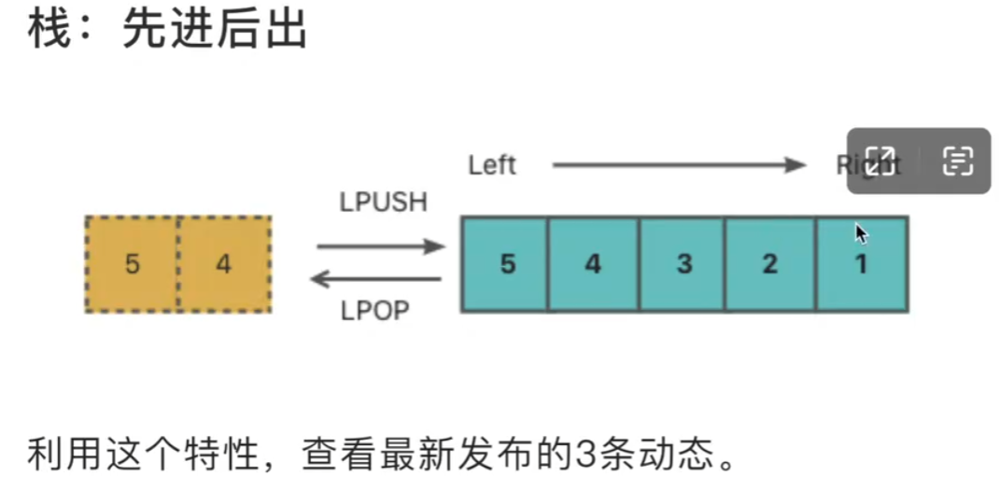
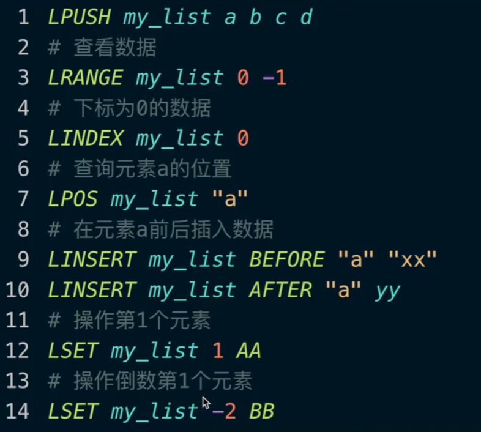
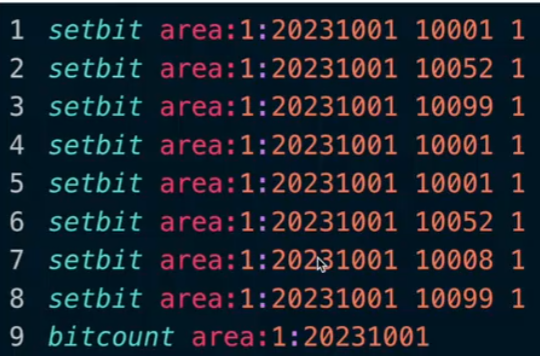

## redis
### 安装

### 功能
- 缓存
- 分布式锁
- 高效的数据结构和算法
- 备注: redis也可以用作消息队列和流处理，但是不推荐。可以使用专门的消息队列，如Kafka, RabbitMQ

### 特点
- 高性能: 数据存储在内存中，读写速度非常快；C编写，底层采用多路复用和非阻塞模型（异步IO）
- 持久化: 可以将数据写入磁盘中，以防止数据丢失；有两种方式: **快照:RDB**； **日志:AOF**； 
- 高可用/分布式: Sentinel哨兵模式；Replication主从复制；Redis Cluster分布式集群 

### String 字符串
#### 缓存
- String通常用于缓存，可用于存储字符、Json字符串或序列化对象；
- ``set k1 v1``
- ``get k1``  //不存在返回nil
- 设置json， ``set user:1 "{\"id\":1, \"name\":\"user1\", \"age\":20}"``
- ``set k3 v3 XX`` //只有当k3存在的时候才会赋值（XX指令的使用）
- ``set k4 v4 NX`` //只有当K4不存在的时候才会赋值（NX指令的使用）

#### 分布式锁
- 分布式锁可以通过**SET NX**指令来实现
- 当多个客户端同时尝试获取锁时，只有第一个成功获取锁的客户端会成功，其他会失败

- 与过期时间配合使用，Redis可以给key设置过期时间，防止数据长时间放在内存中。在分布式锁的场景中，没有设置过期时间，如果某一程序中途异常退出，就会造成死锁。因此，获取锁后，需要设置一个过期时间。即使程序异常退出，超时后会自动释放锁，别的客户端可以重新获取这个锁。
如果程序执行完毕，则使用**DEL**删除键，释放锁。
- ``set mylock client:1 NX EX 1800`` //第一个客户端获取锁，设置过期时间为1800秒
- ``set mylock client:2 NX EX 1800`` //第二个客户端获取锁，返回失败nil
- ``ttl mylock`` //查看过期时间
- ``del mylock`` //程序执行完毕，执行del命令，将锁释放
#### 过期时间
- 过期时间用于设置token，比如单点登录（SSO）
- 门户网站生成token

- 验证token

- 长时间没有返回，需重新登录

#### 计数器
- 计数器可用于统计网页访问量（PV）、独立用户数（UV）等
- ``MSET pv 0 uv 0``
- ``incr uv`` //进行加1操作
- ``incrby pv 3`` //进行加3操作
- ``INCR``命令将字符串值解析为整数，将其增加一，并将得到的值设置为新值
- ``INCR``操作是原子的，不会出现多个请求重复计数的问题
- ``MSET``也是原子的，多个值会被同时设置。

- 其他类似命令
- DECR
- DECRBY
- INCRBYFLOAT


### List 列表
#### redis的List是通过链表（Linked List）实现的。通过不同的指令组组合可以用作栈（stack）和队列（Queue）。
- Queue（先进先出）

- ``LPUSH my_queue task:1 `` //往队列push两个元素
- ``LPUSH my_queue task:2 ``
- ``RPOP my_queue``  //输出为task:1
- ``RPOP my_queue``  //输出为task:2
- Stack（先进后出）

- ``LPUSH unread_msg msg:1 msg:2 msg:3 msg:4 msg:5 `` //在List中放置最近发布的动态
- ``LPOP unread_msg``  //查看最近发布的动态，从同一个方向pop输出为msg:5 
- ``LPOP unread_msg``  //查看最近发布的动态，从同一个方向pop输出为msg:4 
- ``LPUSH unread_msg msg:6 msg:7 msg:8 msg:9 msg:10 `` //在List中放置最近发布的动态
- ``LTRM unread_msg 0 4`` //使用LTRM进行截断保留最新的5条数据
- ``LLen unread_msg`` //查看list的长度，输出为5
- ``LRANGE unread_msg 0 -1`` //查看list,从0开始到-1（列表最后）,输出如下: 
`` 1）"msg:10"``
`` 2）"msg:9"``
`` 3）"msg:8"``
`` 4）"msg:7"``
`` 5）"msg:6"``

#### 阻塞
#### 列表支持阻塞操作。如果列表为空，``BLPOP``、``BRPOP`` 等命令会处于阻塞状态，当新的元素加入时，才会返回结果。

#### 索引操作
#### 我们可以通过索引去操作List中的元素。由于底层使用了链表，随着数据量增大，索引操作效率会降低。
### Set集合
- Set集合中的元素是唯一的，因此用于简单的去重操作、判断元素是否存在、以及统计去重后的数量。
- ``SADD user:1:subscriber 200 201 200 300`` //用户1关注了哪些用户的id,去掉重复的，return 3
- ``SMEMBERS user:1:subscriber`` //查看一下集合,返回如下
`` 1）"200"``
`` 2）"201"``
`` 3）"300"``
``- SCARD user:1:subscriber`` //查看一下不重复的数据数量,return 3

``- SISMEMBER user:1:subscriber 300`` //查看一下某个元素是否存在集合中

##### Set不适合操作大型数据集，会占用大量内存。大型数据集判断元素是否存在，统计不重复的数量，可以使用布隆过滤器和```HyperLogLog。```


#### 去重
#### 交集（共同关注）

##### Redis支持对多个集合进行交集、并集、差集等操作。比如新浪微博，通过redis集合的交集操作，实现共同关注的功能

- ``SADD user:2:subscriber 100 200 300`` 
- ``SADD user:3:subscriber 200 400`` 
- ``SINTER user:1:subscriber user:2:subscriber`` // 查看共同关注，返回200和300
- ``SDIFF user:2:subscriber user:1:subscriber`` // 查看差集
#### 并集


### Sort set（有序集合Zset）
#### 有序集合中，每个元素都关联了一个Score(评分或权重)，用于来集合中的元素进行排序Set是二维的，由于有序集合比Set多了一个纬度，因此也叫Zset。Set的所有操作，Zset也都支持

- 排行榜
- 热搜
- ``ZADD hot_news 300 "科目三"`` //向hot_news中添加一个词条科目三，权重是300
- ``ZADD hot_news 50 "汪峰" 80 "春天里" 83 "新闻播报"`` //向hot_news中添加一个词条科目三，权重是300
- ``ZRANGE hot_news 0 -1`` //查看从0到最后一个
- ``ZRANGE hot_news 0 -1 withscores`` //查看从0到最后一个，并显示评分，(默认是升序)如下输出:
`` 1）汪峰``
`` 2）50``
`` 3）春天里``
`` 4）80``
`` 5）新闻播报``
`` 6）83``
`` 7）科目三``
`` 8）300``
- ``ZRANGE hot_news 0 -1 withscores rev`` //默认是升序,添加参数rev(改为降序)
- ``ZINCRBY hot_news 100 "汪峰"`` //加法操作，输入为

`` 1）春天里``
`` 2）80``
`` 3）新闻播报``
`` 4）83``
`` 5）汪峰``
`` 6）150``
`` 7）科目三``
`` 8）300``
``- ZRANGE hot_news 0 (100 BYSCORE WITHSCORES`` //获取大于0小于100的元素，输出如下: 
`` 1）春天里``
`` 2）80``
`` 3）新闻播报``
`` 4）83``

### Hash 哈希表
#### Redis中的Hash相当于HashMap，可以用于表示对象。
- ``HSET user:101 name jeff tall 18cm weight 60kg `` //HSET命令添加键值对
- ``HGET user:101 name  `` //HGET命令获取键值对，返回"jeff"
- ``HGET user:101 name  `` //HGET命令获取键值对，返回"jeff"

- ``HGETALL user:101``//获取所有键值对，输出如下:
``"name"``
``"jeff"``
``"tall"``
``"180cm"``
``"weight"``
``"60kg"``

``- HKEYS user:101``//获取所有键
``- HVALS user:101``//获取所有值

### Bitmap 位图
#### Bitmap可以看作是二进制位(bit)组成的一个数组，他可以对位进行操作
- 统计在线用户数
#### 例如Bitmap常用于统计在线人数，每个bit表示用户是否在线。如果有1亿个用户，仅需占用12.5M的内存。用户上线，将用户id对应的bit设置为1，离线设置为0。
- ``SETBIT oneline_users 101 1``//将101位的用户设置为1
- ``SETBIT oneline_users 201 1``//将201位的用户设置为1
- ``SETBIT oneline_users 301 1``//将301位的用户设置为1
- ``SETBIT oneline_users 401 1``//将401位的用户设置为1
- ``BITCOUNT oneline_users``//统计在线数量，返回4
- ``SETBIT oneline_users 401 0``//将401位的用户设置为0，下线了
- ``BITCOUNT oneline_users``//统计在线数量，返回3

- 精确去重统计
#### 大型数据集的去重，使用Set不适合，可以使用Bitmap。比如:日志信息:根据基站数据统计某个区域内某日的游客数量
```
手机标识，基站id，连接时间
10001，1，2023-10-01 08:01:0110052，1，2023-10-01 08:02:05
10099，2，2023-10-01 09:21:07
10001，2，2023-10-01 10:05:09
10001，3，2023-10-01 11:51:49
10052，4，2023-10-01 12:35:09
10008，2，2023-10-01 05:20:06
10099，3，2023-10-01 11:11:55
```

#### 每次获取一个日志，将用户的唯一标识放入(SETBIT)当天某个区域的bitmap里面，重复加入也没有关系。最后通过BITCOUNT来统计不重复的数量。

### HyperLogLog 基数计算
- 估算不重复元素的数量

#### ```HyperLogLog```是一种概率性数据结构，基数计算用于估算集合中不重复元素的数量，相当于Distinct Count。
#### HyperLogLog牺牲了一部分精度，换来了更高效的内存利用。这个算法的神奇之处在于计数项与内存使用量不成正比。Redis的HyperLogLog实现使用最多12 KB的空间，误差不超过1%。
- ``PFADD hllog a b c d e f g i j k l m n ``//使用PFADD命令在集合hllog中加入元素
- ``PFCOUNT hllog ``//使用PFCOUNT命令统计集合hllog中不重复的元素


