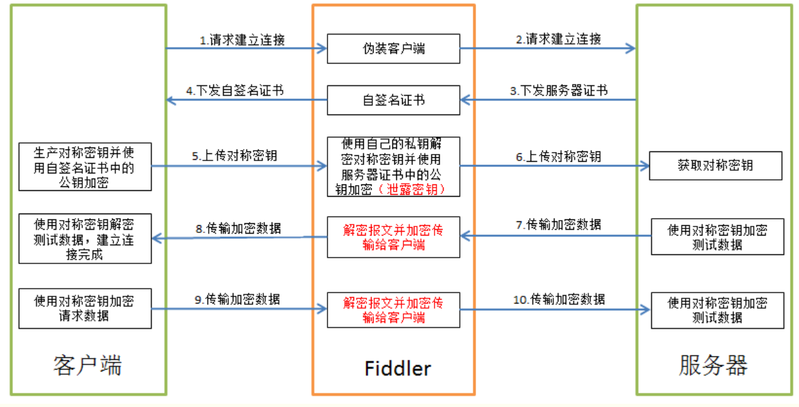

## 测试开发知识点
### 测试工具
#### 抓包
- 在应用的开发调试中，查看软件实际运行时HTTP/HTTPS通信的请求数据和返回数据，从而分析问题的过程就叫做抓包。通常我们说的抓包主要是分为两种：
- 使用Wireshark抓取传输层的TCP/UDP通信包。
- 使用Fiddler或者Charles抓取应用层的HTTP/HTTPS通信包。
- 在大部分场景下，我们只是需要抓取应用层的HTTP/HTTPS数据包也就是第二种方式。

#### fiddler 的抓包原理
- Fiddler是位于客户端和服务器端之间的HTTP代理， 记录客户端和服务器之间的所有 HTTP(S)请求，可以针对特定的HTTP(S)请求，分析网络传输的数据，还可以设置断点、修改请求的数据和服务器返回的数据。
- Fiddler在浏览器与服务器之间建立一个代理服务器，Fiddler工作于七层中的应用层，能够捕获通过的HTTP(S)请求。Fiddler启动后会自动将代理服务器设置成本机，默认端口为8888。Fiddler不仅能记录PC上浏览器的网络请求数据，还可以记录同一网络中的其他设备的HTTP(S)请求数据。数据传递流程大致如下：

- 1) 客户端像WEB服务器发送HTTP(S)请求时，请求会先经过代理Fiddler代理服务器。
- 2) Fiddler代理服务器截取客户端的请求报文，再转发到WEB服务器，转发之前可以做一些请求报文参数修改的操作。
- 3) WEB服务器处理完请求以后返回响应报文，Fiddler代理服务器会截取WEB服务器的响应报文。
- 4) Fiddler处理完响应报文后再返回给客户端。
#### Fiddler抓取HTTPS原理
- 现在APP中的数据传输基本上都使用HTTS传输，传输的数据都是经过加密的，这增加了我们分析数据包的难度，还好Fiddler除了可以抓取HTTP数据包，还可以抓取HTTPS数据包。由于HTTPS传输需要使用到CA证书，所以抓取抓取HTTPS数据包时需要做一些特殊配置。Fiddler截取HTTPS报文的流程大致如下：

- 1) 客户端请求建立HTTPS链接，发送客户端支持的加密协议及版本列表等信息给服务器端。
- 2) Fiddler接受客户端请求并伪装成客户端向WEB服务器发送相同的请求。
- 3) WEB服务器收到Fiddler的请求以后，从请求中筛选合适的加密协议。并返回服务器CA证书，证书中包括公钥信息。
- 4) Fiddler收到WEB服务器的响应后保存服务器证书并自签名一个CA证书，伪装成服务器，把该证书下发给客户端。
- 5) 客户端验证证书合法性。（Fiddler能否抓取到HTTPS报文关键看这一步）
- 6) 客户端生产对称密钥，通过证书的公钥加密发送给服务器。
- 7) Fiddler拦截客户端的请求以后，使用私钥解密该报文，获取对称加密秘钥，并使用服务器证书中带的公钥加密该对称密钥发送给WEB服务器。此时对称密钥已经泄露了，以后可以使用该秘钥界面客户端和服务器端传输的数据。
- 8) WEB服务器接收到客户端发送的加密的对称密钥后使用私钥解密，并使用对称密钥加密测试数据传给客户端。
- 9) Fiddler使用前面获取的对称密钥解密报文。
- 10) 客户端验证数据无误以后HTTPS连接就建立完成，客户端开始向服务器发送使用对称密钥加密的业务数据
- 11) Fiddler使用前面获取的对称密钥解密客户端发送的数据并重新加密转发给客户端。

#### fiddler 怎么抓取 https 请求？

#### wireshark 抓包的头部有什么？